# Module 3 – Logic Optimization

## Overview

Module 3 of the VLSI RTL Design and Synthesis Workshop focused on the fundamentals of logic optimization.

Logic optimization aims to transform a design into an optimized implementation while preserving its functionality. The major objectives are to reduce area and power consumption and improve timing and performance.

Logic optimization can be broadly classified into:

- Combinational Logic Optimization
- Sequential Logic Optimization

---

## 1. Combinational Logic Optimization

Combinational logic optimization involves simplifying combinational logic while maintaining the required functionality.

The main objective is to obtain an optimized implementation with reduced:

- Area
- Power consumption
- Logic complexity

### 1.1 Constant Propagation

Constant propagation identifies signals that have constant values and propagates those values through the logic.

This allows redundant logic to be simplified or eliminated.

For example, if an input is permanently connected to logic `0` or `1`, the synthesis tool can simplify the surrounding logic accordingly.

---

## 2. Direct Optimization

Direct optimization identifies redundant or unnecessary logic and simplifies the design without changing its functionality.

Examples include:

- Removing redundant logic
- Eliminating unnecessary gates
- Simplifying logic expressions
- Removing unused signals

These transformations help reduce circuit complexity.

---

## 3. Boolean Logic Optimization

Boolean logic optimization simplifies logical expressions using Boolean algebra and logic minimization techniques.

The objective is to implement the same functionality using fewer or more efficient logic elements.

Boolean optimization can result in:

- Reduced gate count
- Reduced area
- Reduced switching activity
- Improved performance

---
### RTL Code

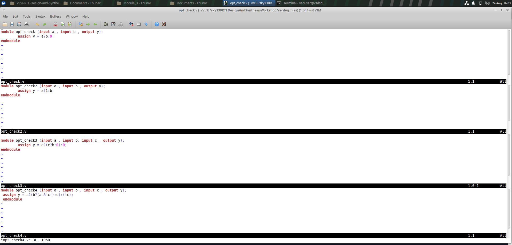

#### Yosys Optimization Result

The following screenshots show the optimization results obtained during the synthesis process.

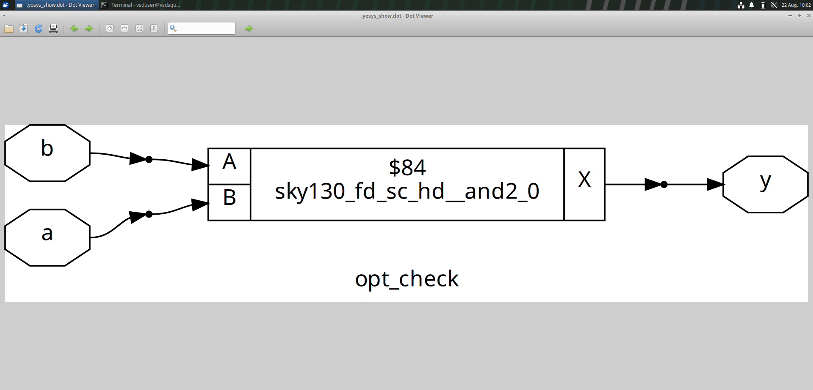

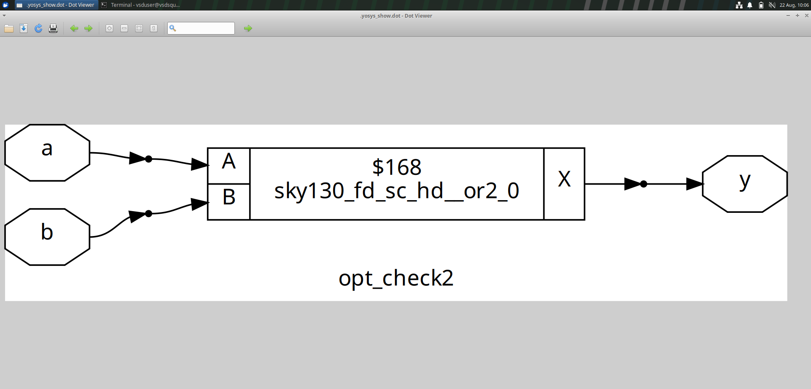

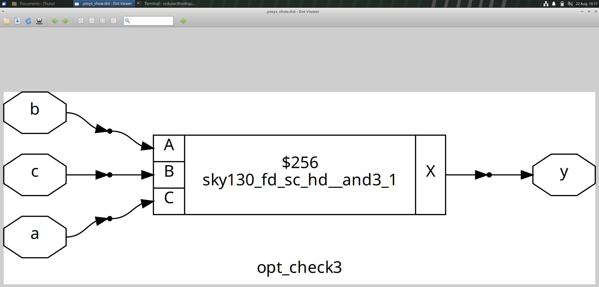

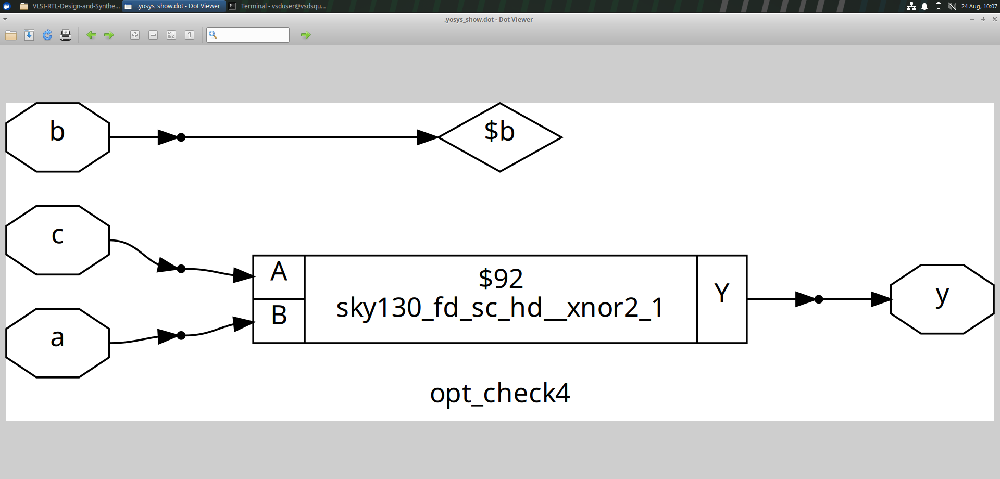

# 4. Sequential Logic Optimization

Sequential logic optimization deals with optimizing circuits containing storage elements such as flip-flops and registers.

Sequential optimization can be classified into:

- Basic Sequential Optimization
- Advanced Sequential Optimization

---

## 5. Basic Sequential Optimization

Basic sequential optimization simplifies sequential logic while preserving the required state behavior.

### Sequential Constant Optimization

Sequential constant optimization identifies registers or sequential signals that have constant values or unnecessary state behavior.

Redundant sequential logic can then be simplified or removed.

This can reduce:

- Number of sequential elements
- Area
- Power consumption
- Logic complexity

---

# 6. Advanced Sequential Optimization

Advanced sequential optimization involves transformations of sequential logic while preserving the functional behavior of the design.

### 6.1 State Optimization

State optimization reduces unnecessary or redundant states in sequential circuits.

Equivalent or unnecessary states can be eliminated or merged while maintaining the required external behavior.

This can reduce the amount of logic and storage required for implementing a state machine.

### 6.2 Retiming

Retiming is a sequential optimization technique in which registers are moved across combinational logic while preserving the functional behavior of the circuit.

The objective is to improve timing characteristics by redistributing combinational logic between registers.

Retiming can help:

- Reduce critical-path delay
- Improve maximum operating frequency
- Balance combinational logic between registers

### 6.3 Sequential Logic Cloning

Sequential logic cloning involves creating additional copies of sequential logic when required to improve timing or other implementation characteristics.

Cloning can help reduce fanout and improve timing on critical paths.

However, cloning may increase:

- Area
- Power consumption

Therefore, it is used when the timing benefit justifies the additional hardware.

---
## Sequential Constant Optimization

Sequential constant optimization was demonstrated using D Flip-Flop based examples.

The `dff_const` examples demonstrate how constant values in sequential logic can be identified and optimized while preserving the required functionality.

### RTL Code

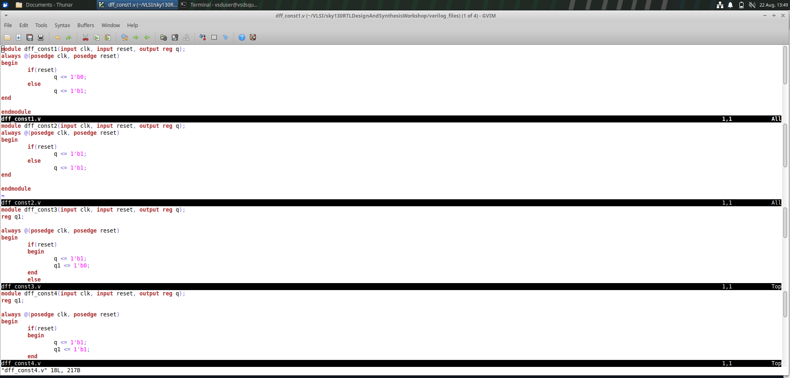
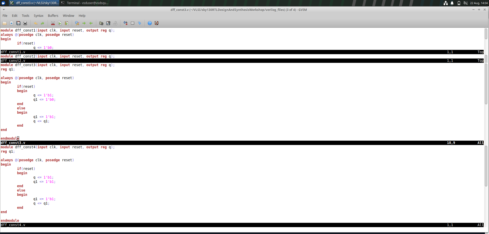
### DFF Constant Optimization – Example 1

#### Yosys Optimization Result

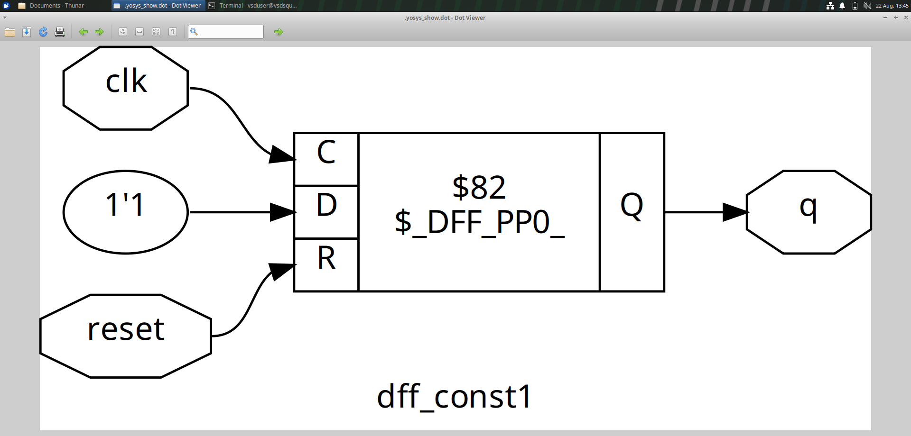

#### GTKWave Simulation

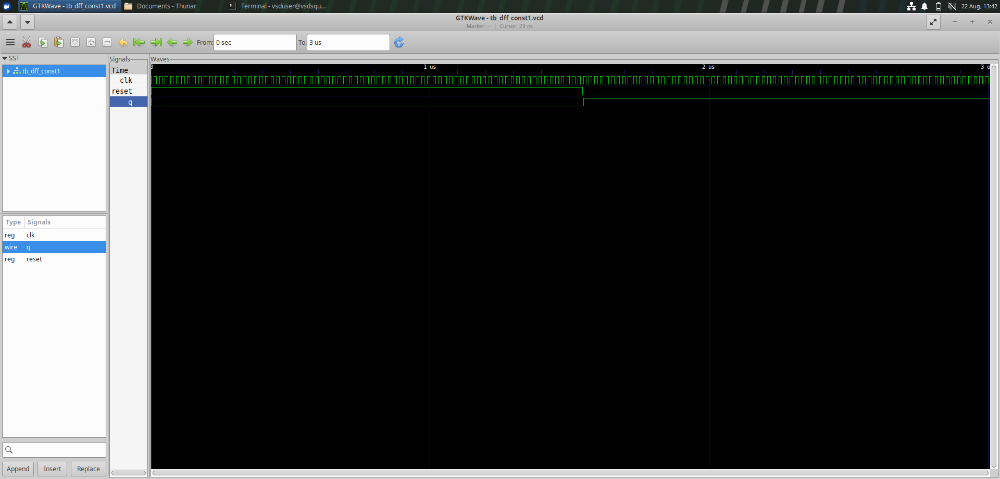

### DFF Constant Optimization – Example 2

#### Yosys Optimization Result

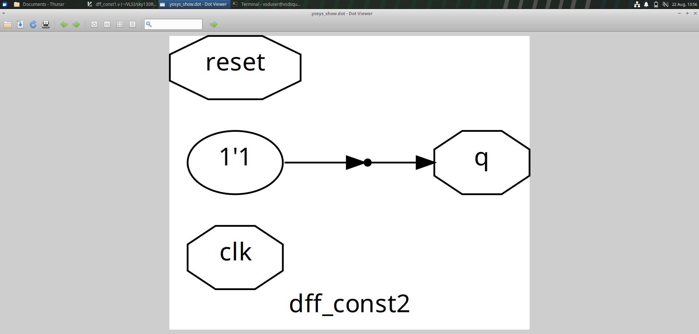

#### GTKWave Simulation

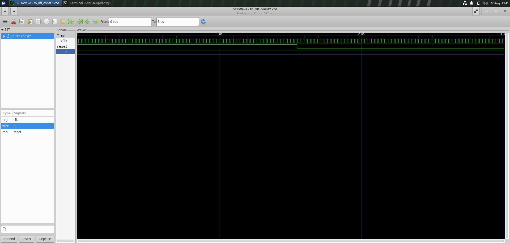

### DFF Constant Optimization – Example 3

#### Yosys Optimization Result

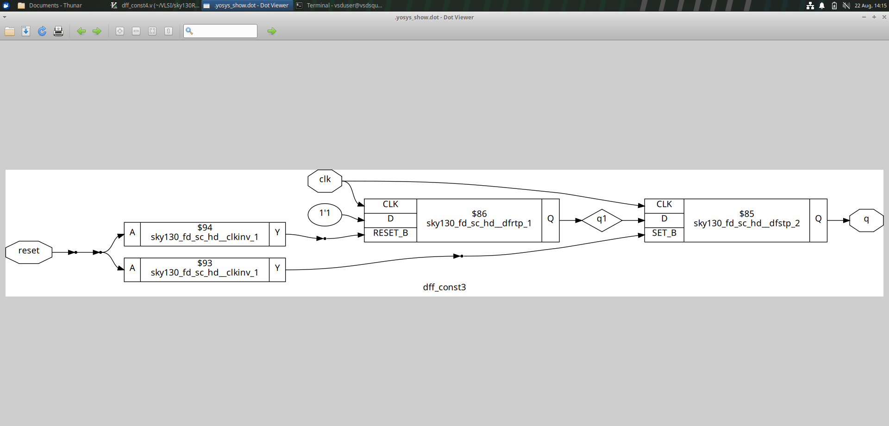

#### GTKWave Simulation

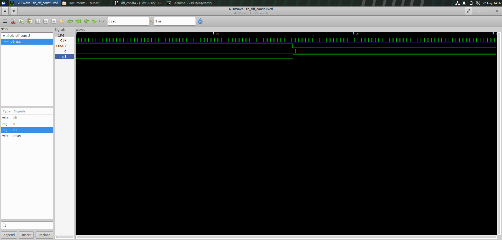

### DFF Constant Optimization – Example 4

#### Yosys Optimization Result

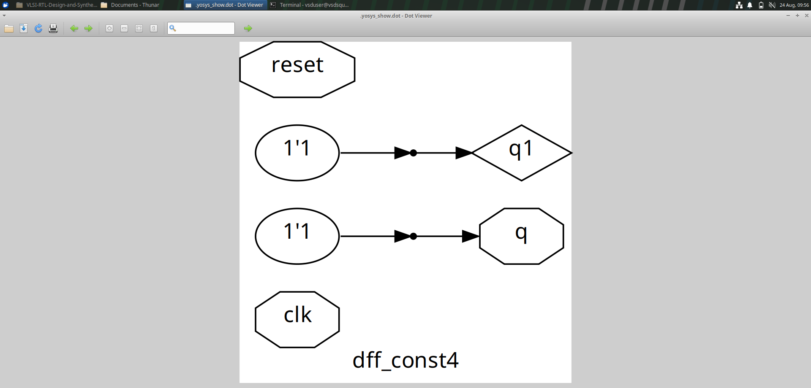

#### GTKWave Simulation

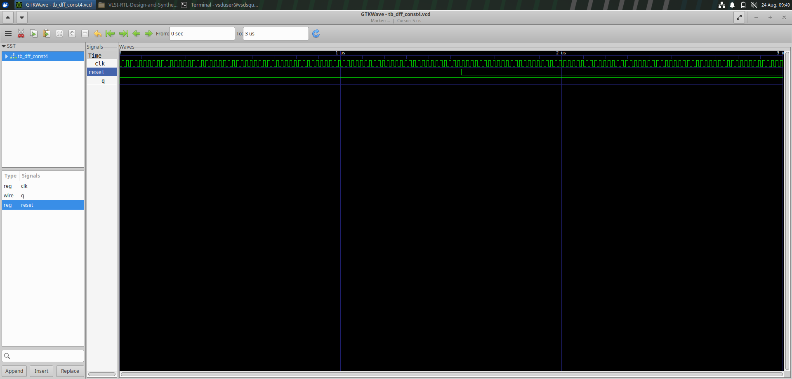

### DFF Constant Optimization – Example 5

#### Yosys Optimization Result

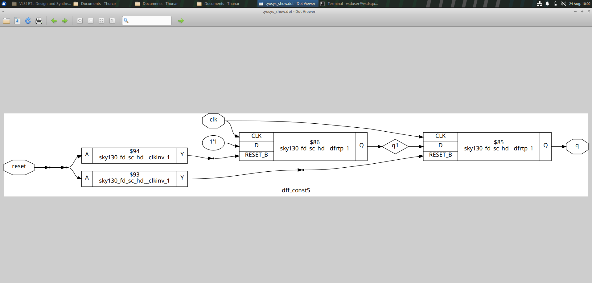

#### GTKWave Simulation

### Multiple Modules Optimization – Example 5

#### Yosys Optimization Result - Example 1

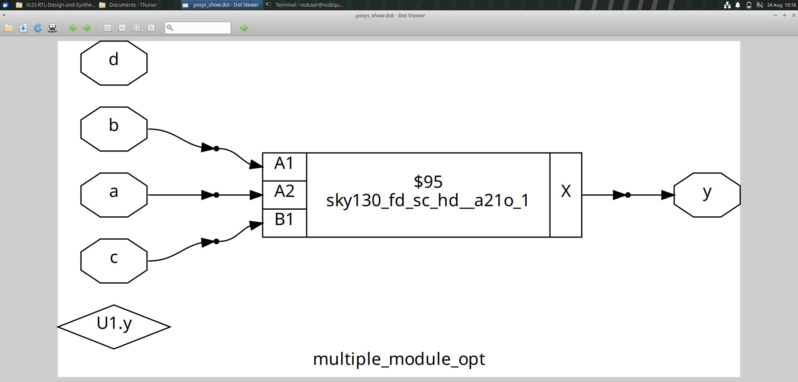

#### Yosys Optimization Result - Example 2

# 7. Optimization Objectives

Logic optimization involves trade-offs between:

- Area
- Power
- Performance
- Timing

Improving one parameter may sometimes negatively affect another.

For example, logic cloning may improve timing but increase area and power.

Therefore, synthesis optimization attempts to achieve an appropriate balance between different design objectives.

---

# 8. Optimization Flow

A simplified optimization flow is:

    RTL Design
         |
         v
    Logic Analysis
         |
         v
    Combinational Optimization
         |
         v
    Sequential Optimization
         |
         v
    Optimized Logic
         |
         v
    Technology Mapping
         |
         v
    Optimized Netlist

---

# 9. Practical Work

The Module 3 practical work involved examining RTL designs and observing the effects of logic optimization during the RTL-to-synthesis flow.

The Verilog source files and screenshots associated with the practical work are included in this directory.

---

# 10. Key Learnings

- Understood the concept of logic optimization.
- Learned about combinational logic optimization.
- Understood constant propagation.
- Learned about direct optimization.
- Understood Boolean logic optimization.
- Learned the basics of sequential logic optimization.
- Understood sequential constant optimization.
- Learned about state optimization.
- Understood retiming.
- Learned about sequential logic cloning.
- Understood the trade-offs between area, power, and timing.

---

## Conclusion

Module 3 introduced important logic optimization techniques used in RTL design and synthesis.

The module covered combinational optimization techniques such as constant propagation, direct optimization, and Boolean logic optimization.

It also introduced sequential optimization techniques including sequential constant optimization, state optimization, retiming, and sequential logic cloning.

These techniques are important for obtaining efficient digital implementations while preserving the required functionality.
