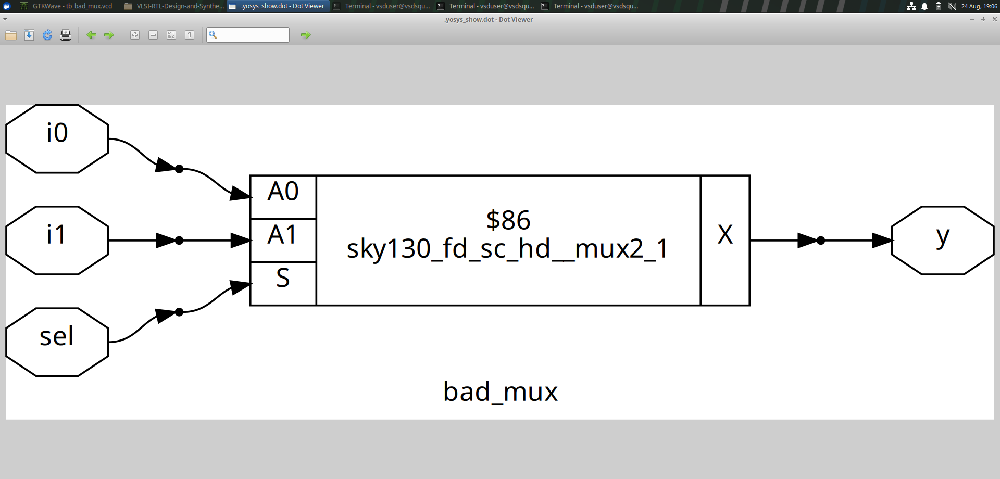
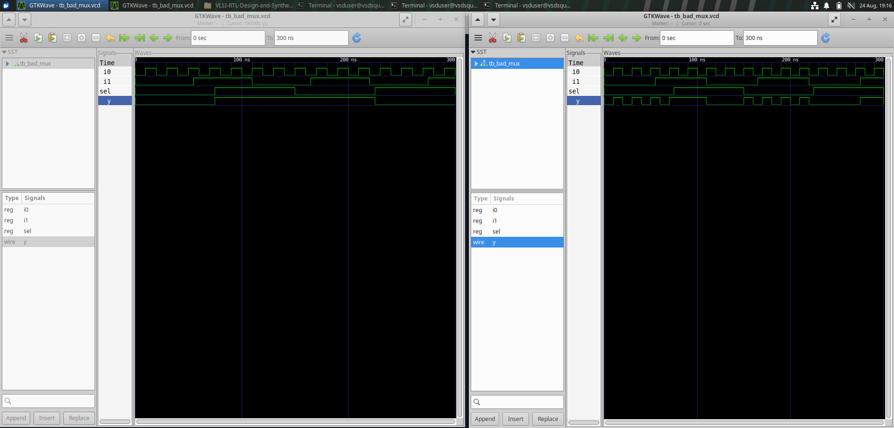
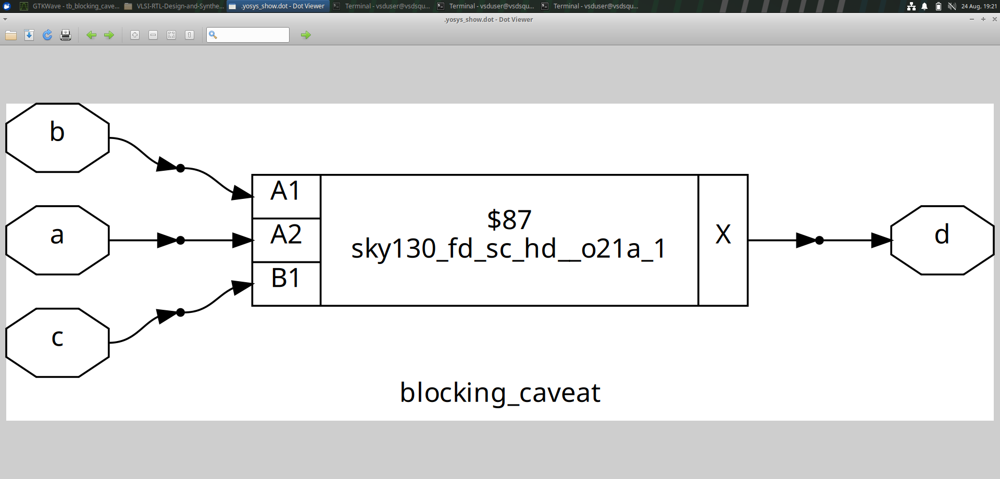
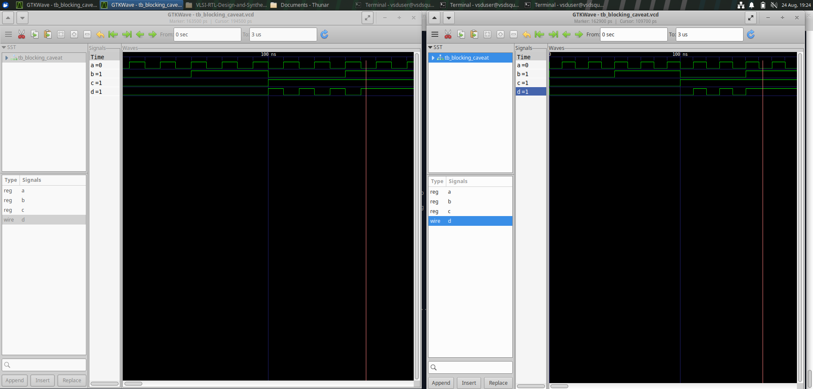

# Module 4 – GLS, blocking vs non-blocking and Synthesis-Simulation mismatch

## Overview

Module 4 of the VLSI RTL Design and Synthesis Workshop focused on Gate-Level Simulation (GLS) and synthesis-simulation mismatch.

Gate-Level Simulation is performed on the synthesized gate-level netlist to verify that the synthesized design maintains the intended functionality of the RTL design.

---

## 1. Gate-Level Simulation (GLS)

Gate-Level Simulation is the process of simulating the synthesized gate-level netlist using a Verilog simulator.

The basic flow is:

    RTL Design
         |
         v
      Synthesis
         |
         v
    Gate-Level Netlist
         |
         v
    Gate-Level Simulation
         |
         v
    Waveform Analysis

Icarus Verilog can be used to simulate the synthesized netlist, and GTKWave can be used to analyze the generated waveforms.

---

## 2. Why Gate-Level Simulation?

GLS is performed to:

- Verify the functionality of the synthesized design.
- Check whether synthesis has preserved the intended RTL behavior.
- Identify synthesis-related issues.
- Analyze timing behavior when delay information is available.

---

## 3. Functional and Timing Simulation

### Functional Simulation

Functional GLS verifies whether the synthesized gate-level netlist produces the expected outputs.

### Timing Simulation

Timing GLS considers the delays associated with the synthesized cells and paths.

Timing information can be included using delay annotation.

Therefore, GLS can be used for:

- Functional verification
- Timing verification

---

## 4. Synthesis-Simulation Mismatch

A synthesis-simulation mismatch occurs when the behavior of the RTL simulation differs from the behavior of the synthesized gate-level design.

Some common causes discussed in this module are:

- Missing sensitivity list
- Incorrect use of blocking and non-blocking assignments
- Non-standard Verilog coding
- Changes in RTL code

---
## 5. Missing Sensitivity List

A sensitivity list specifies the signals that cause an `always` block to execute.

For example:

```verilog
always @(a or b)
If a signal affecting the logic is missing from the sensitivity list, simulation may not update correctly when that signal changes.

This can result in a synthesis-simulation mismatch.

---
##6. Blocking and Non-Blocking Assignments
##Blocking Assignment

Blocking assignment uses = and is generally used for combinational logic.

always @(*)
begin
    a = b;
    c = a;
end
##Non-Blocking Assignment

Non-blocking assignment uses <= and is generally used for sequential logic.

always @(posedge clk)
begin
    a <= b;
    c <= a;
end

Using the appropriate assignment type is important for correctly modeling the intended hardware.
---
7. Practical Gate-Level Simulation

Three cases were studied during the practical work:

Two synthesis-simulation mismatch cases
One synthesis-simulation matching case

The Yosys synthesis results and GTKWave waveforms were examined for each case.
---

### PART 2

```markdown
## 8. Synthesis-Simulation Mismatch – Case 1

The first example demonstrated a mismatch between RTL simulation and Gate-Level Simulation.

### Yosys Result



### GTKWave Waveform




---

## 9. Synthesis-Simulation Mismatch – Case 2

The second example demonstrated another synthesis-simulation mismatch.

### Yosys Result



### GTKWave Waveform



---

## 10. Synthesis-Simulation Match

The third example demonstrated a matching case where the RTL and synthesized gate-level behavior were consistent.

### Yosys Result


### GTKWave Waveform


---

## 11. Overall RTL-to-GLS Flow

    RTL Design
         |
         v
    RTL Simulation
         |
         v
      Synthesis
         |
         v
    Gate-Level Netlist
         |
         v
 Gate-Level Simulation
         |
         v
    GTKWave Analysis

---

## 12. Key Learnings

- Understood the concept of Gate-Level Simulation.
- Learned why GLS is performed after synthesis.
- Understood functional and timing verification.
- Learned about synthesis-simulation mismatch.
- Understood the effect of a missing sensitivity list.
- Learned the difference between blocking and non-blocking assignments.
- Understood the importance of proper Verilog coding.
- Compared two mismatch cases and one matching case.
- Verified synthesized designs using Yosys and GTKWave.

---

## Conclusion

Module 4 provided practical understanding of Gate-Level Simulation and synthesis-simulation mismatch.

The module covered GLS using Icarus Verilog, waveform analysis using GTKWave, functional and timing verification, and common causes of synthesis-simulation mismatch.

Two mismatch cases and one matching case were studied to understand the relationship between RTL simulation and synthesized gate-level simulation.
