# Module 5: Optimization in synthesis


## 1. Overview

This module focuses on commonly used Verilog constructs for conditional logic and repeated hardware structures.

The concepts covered in this module include:

- `if` statements
- `if-else` statements
- Inferred latches using incomplete `if` statements
- `case` statements
- Incomplete `case` statements
- Partial assignments in `case` statements
- Difference between `if` and `case`
- Procedural `for` loops
- Generate `for` loops
- Difference between `for` and `generate for`

The objective is to understand how these Verilog constructs describe hardware and how incomplete assignments can result in unintended latch inference.

The RTL designs are simulated using Icarus Verilog, synthesized using Yosys, and analyzed using GTKWave.

---## 2. If Statements

An `if` statement is used to describe conditional logic in Verilog.

It allows different assignments to be made depending on whether a specified condition is true or false.

### Basic If Statement

```verilog
always @(*) begin
    if (sel)
        y = a;
end
```

In this example, `y` is assigned the value of `a` only when `sel` is high.

### If-Else Statement

```verilog
always @(*) begin
    if (sel)
        y = a;
    else
        y = b;
end
```

In this example, `y` receives a value for both possible conditions of `sel`.

The `if-else` construct is commonly used to describe conditional combinational logic.

### If-Else If Statement

An `if-else if` statement is used when multiple conditions need to be checked.

The conditions are evaluated in sequence.

```verilog
always @(*) begin
    if (sel == 2'b00)
        y = a;
    else if (sel == 2'b01)
        y = b;
    else if (sel == 2'b10)
        y = c;
    else
        y = d;
end
```

In this example, the conditions are checked from top to bottom.

If the first condition is true, the corresponding assignment is performed and the remaining conditions are not evaluated.

If the first condition is false, the next `else if` condition is checked.

The final `else` handles all remaining conditions.

### Priority Behavior

An `if-else if` chain can describe priority-based logic because the conditions are evaluated in order.

For example:

```verilog
always @(*) begin
    if (a)
        y = 2'b01;
    else if (b)
        y = 2'b10;
    else if (c)
        y = 2'b11;
    else
        y = 2'b00;
end
```

If both `a` and `b` are high, the first condition has priority and `y` is assigned `2'b01`.

Therefore, the order of conditions in an `if-else if` statement is important.

---

## 3. Latch Inference Using If Statements

An unintended latch can be inferred when a signal is not assigned for every possible condition.

### Incomplete If Statement

```verilog
always @(*) begin
    if (sel)
        y = a;
end
```

When `sel = 1`, `y` is assigned the value of `a`.

However, when `sel = 0`, there is no assignment to `y`.

Therefore, the hardware must retain the previous value of `y`, which can result in latch inference.

### Corrected Version

```verilog
always @(*) begin
    if (sel)
        y = a;
    else
        y = b;
end
```

In the corrected version, `y` is assigned in all possible conditions.

This prevents unintended latch inference and correctly describes combinational logic.

### RTL Code

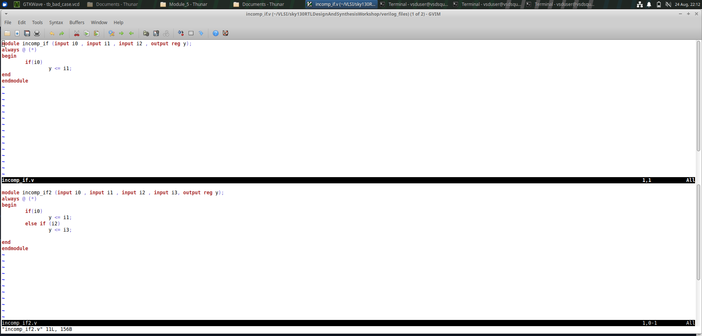)

### Yosys Result

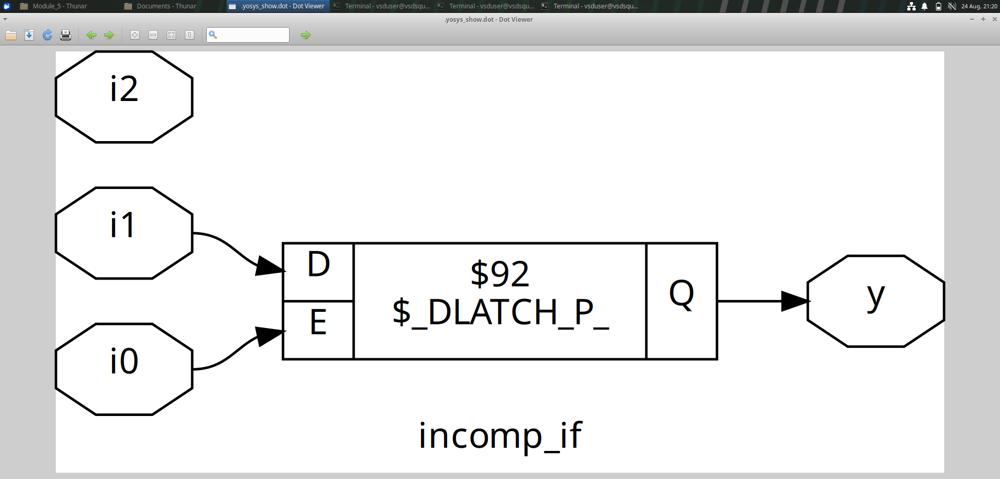

### GTKWave Waveform

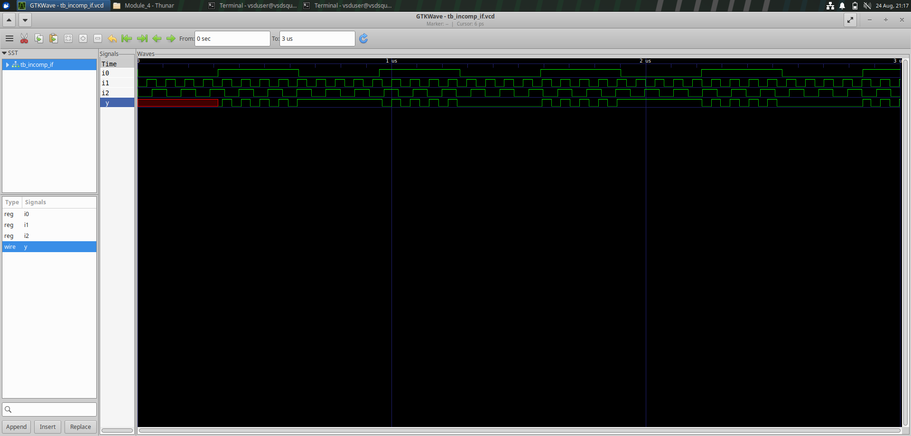

### Yosys Result

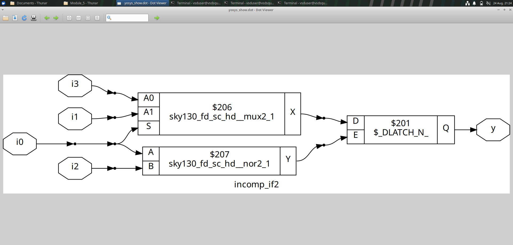

### GTKWave Waveform

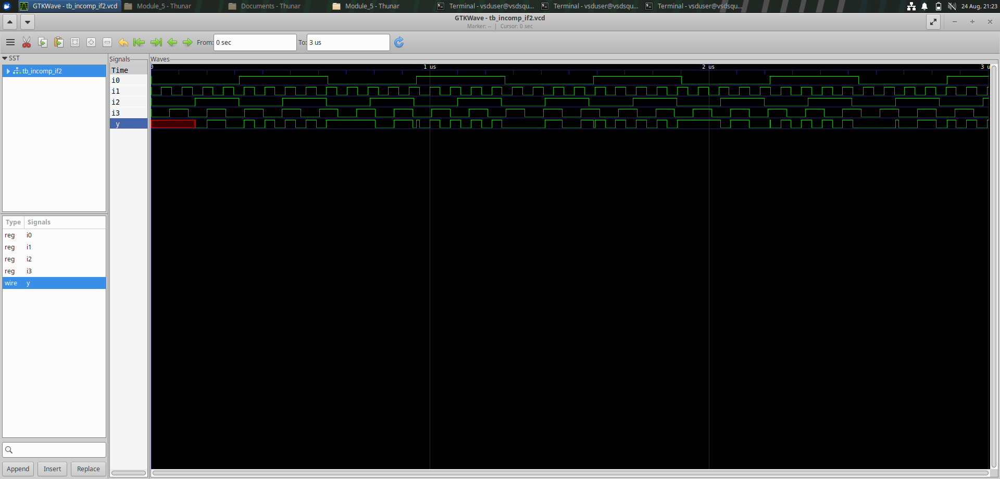
---

## 4. Case Statements

A `case` statement is used when a single expression must be compared with multiple possible values.

It is commonly used for:

- Multiplexers
- Decoders
- Finite State Machines
- Control logic

### Example

```verilog
always @(*) begin
    case (sel)
        2'b00: y = a;
        2'b01: y = b;
        2'b10: y = c;
        default: y = d;
    endcase
end
```

The value of `sel` determines which input is assigned to `y`.

The `default` statement handles all remaining input combinations.

---

## 5. Incomplete Case Statement

An incomplete `case` statement does not handle all possible input combinations.

### Example

```verilog
always @(*) begin
    case (sel)
        2'b00: y = a;
        2'b01: y = b;
    endcase
end
```

In this example, the values `2'b10` and `2'b11` are not handled.

When these conditions occur, `y` does not receive a new assignment.

As a result, the synthesized hardware may retain the previous value of `y`, which can result in latch inference.

### Corrected Version

```verilog
always @(*) begin
    case (sel)
        2'b00: y = a;
        2'b01: y = b;
        default: y = 1'b0;
    endcase
end
```

The `default` statement ensures that `y` receives a value for all remaining conditions.

This helps avoid unintended latch inference.

### RTL Code

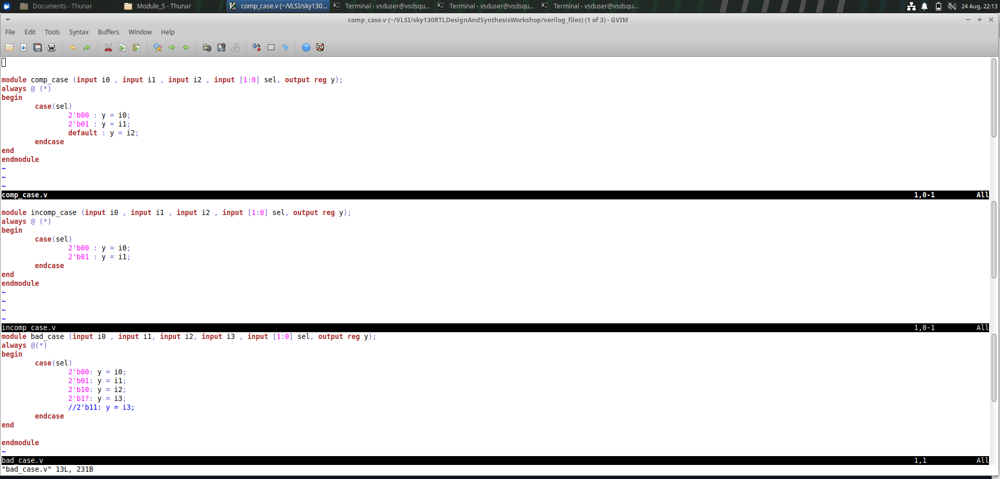)

### Yosys Result

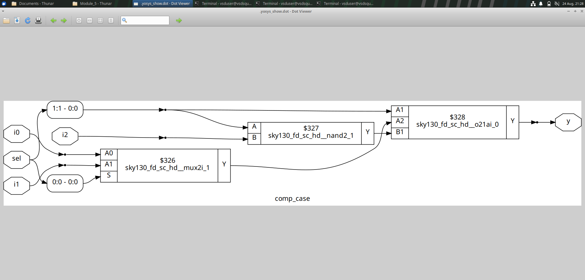

### GTKWave Waveform


### Yosys Result

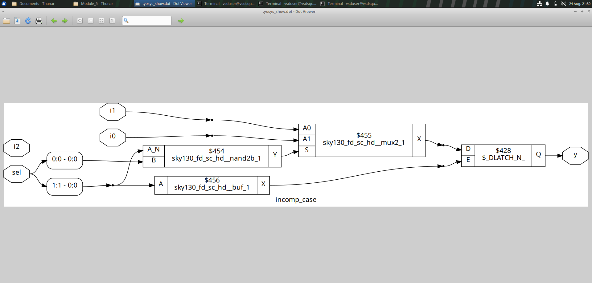

### GTKWave Waveform


### GTKWave Waveform

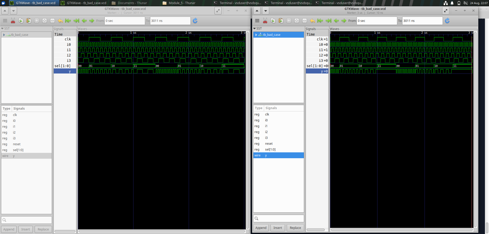
---

## 6. Partial Assignment in Case Statements

Partial assignment occurs when only some bits of a signal are assigned in a particular branch.

### Example

```verilog
always @(*) begin
    case (sel)
        1'b0: y[1:0] = a[1:0];
        1'b1: y[3:2] = a[3:2];
    endcase
end
```

In this example, not all bits of `y` are assigned in every branch.

When `sel = 0`, only `y[1:0]` is assigned.

When `sel = 1`, only `y[3:2]` is assigned.

The remaining bits may need to retain their previous values, which can result in partial latch inference.

### Corrected Version

A default assignment can be provided before the `case` statement.

```verilog
always @(*) begin
    y = 4'b0000;

    case (sel)
        1'b0: y[1:0] = a[1:0];
        1'b1: y[3:2] = a[3:2];
    endcase
end
```

In this example, all bits of `y` are assigned a default value before the `case` statement.

The selected bits are then updated based on the value of `sel`.

This avoids unintended latch inference.

### Yosys Result

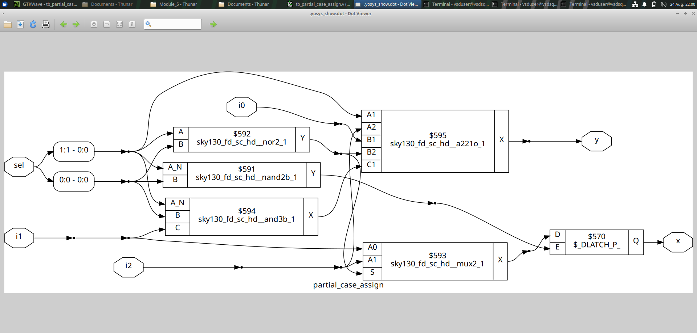

### GTKWave Waveform

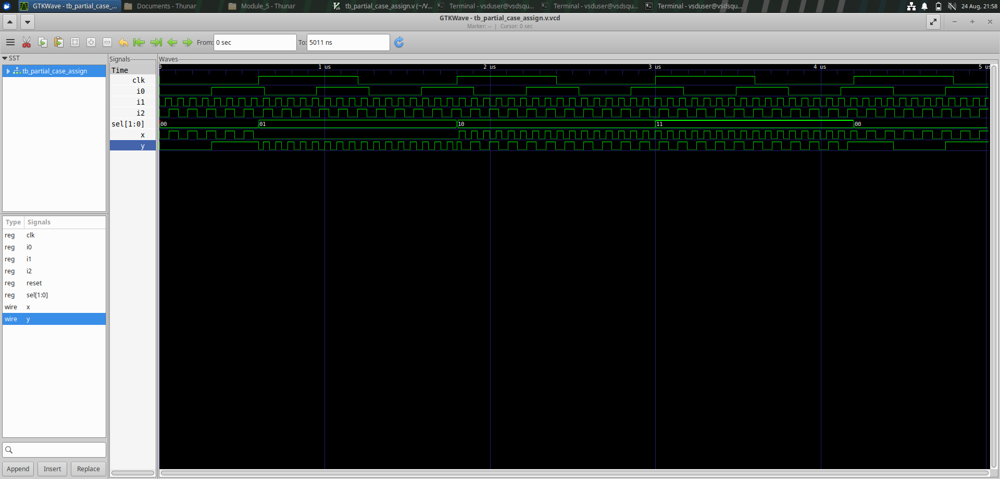

---

## 7. Difference Between If and Case Statements

| Feature | `if` Statement | `case` Statement |
|---|---|---|
| Selection type | Conditional selection | Value-based selection |
| Conditions | Can use Boolean expressions | Compares one expression with multiple values |
| Priority | Conditions are evaluated in order | Commonly used for mutually exclusive selections |
| Common use | Conditional and priority logic | Multiplexers, decoders and FSMs |
| Default handling | `else` statement | `default` statement |
| Latch inference | Possible with incomplete assignments | Possible with incomplete or partial assignments |

Both constructs can describe combinational or sequential logic depending on how they are used.

Complete assignments are important to avoid unintended latch inference in combinational logic.

---

## 8. Procedural For Loop

A procedural `for` loop is used inside a procedural block such as an `always` block.

It is useful for describing repeated operations on vectors or arrays.

### Example

```verilog
integer i;

always @(*) begin
    for (i = 0; i < 4; i = i + 1)
        y[i] = a[i] & b[i];
end
```

In this example, the `for` loop performs a bit-wise AND operation for each bit.

The synthesis tool expands the repeated logic into the corresponding hardware structure.

A procedural `for` loop is commonly used for:

- Bit-wise operations
- Array operations
- Repeated combinational logic
- Register initialization in appropriate sequential logic

---

## 9. Generate For Loop

A `generate for` loop is used to create repeated hardware structures at the module level.

The loop is evaluated during elaboration.

A `genvar` variable is used to control the generate loop.

### Example

```verilog
genvar i;

generate
    for (i = 0; i < 4; i = i + 1) begin
        and_gate u_and (
            .a(a[i]),
            .b(b[i]),
            .y(y[i])
        );
    end
endgenerate
```

In this example, four instances of the `and_gate` module are generated.

Each generated instance operates on one bit of the input vectors.

Generate loops are useful for:

- Repeated module instantiation
- Parameterized hardware structures
- Repeated structural logic
- Scalable RTL designs

### RTL Code

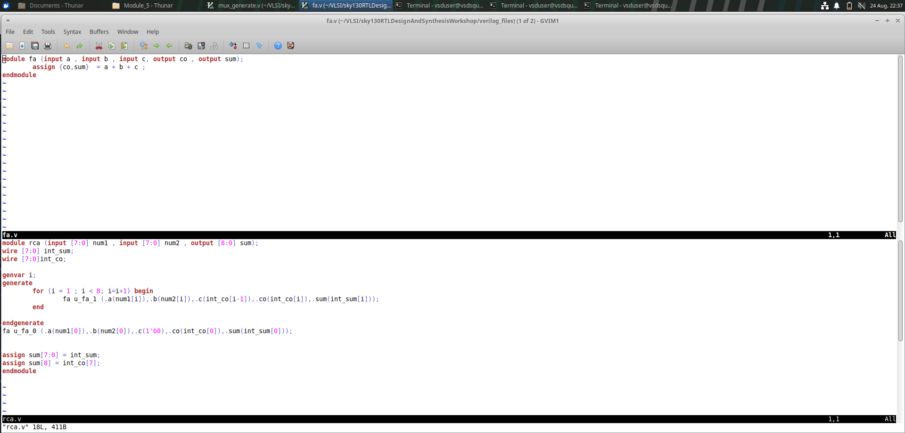

### GTKWave Waveform

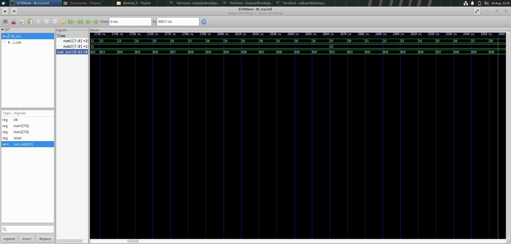

### GTKWave Waveform

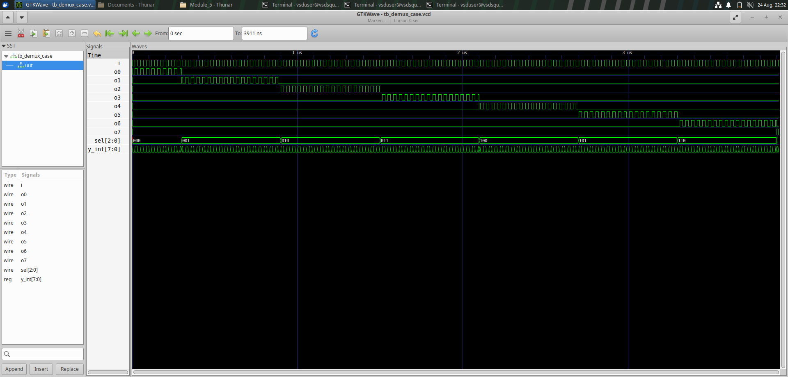

### GTKWave Waveform

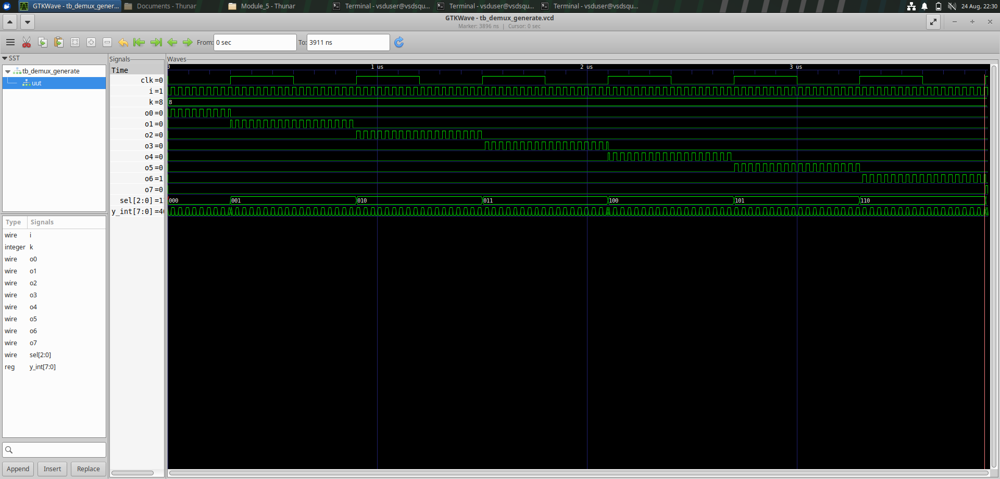
---

## 10. Difference Between For and Generate For

| Feature | Procedural `for` Loop | Generate `for` Loop |
|---|---|---|
| Location | Inside an `always` block or procedural block | At module level |
| Loop variable | Usually `integer` | `genvar` |
| Purpose | Repeated procedural statements | Repeated hardware structures |
| Common use | Vectors, arrays and repeated logic | Multiple module instances |
| Evaluation | Executes as part of procedural simulation behavior | Evaluated during elaboration |
| Hardware description | Describes repeated operations | Creates repeated instances or structures |

A procedural `for` loop is generally used when repeated operations are required inside an existing procedural block.

A `generate for` loop is used when repeated hardware structures or module instances need to be created.

---


---

## 11. Key Learnings

- Understood the use of `if` and `if-else` statements in Verilog.
- Learned how conditional statements describe hardware.
- Understood how incomplete `if` statements can infer latches.
- Learned the importance of assigning outputs in all possible conditions.
- Understood the use of `case` statements for multi-way selection.
- Learned the difference between complete and incomplete `case` statements.
- Understood how incomplete `case` statements can result in latch inference.
- Learned about partial assignments in `case` statements.
- Understood how unassigned bits can result in unintended storage behavior.
- Learned how default assignments can help prevent unintended latch inference.
- Compared the behavior and applications of `if` and `case` statements.
- Learned the use of procedural `for` loops.
- Understood how repeated operations can be described using a `for` loop.
- Learned the purpose of `generate for` loops.
- Understood the difference between `integer` and `genvar`.
- Compared procedural repetition with structural hardware generation.
- Verified RTL designs using Icarus Verilog, Yosys, and GTKWave.

---

## Conclusion

Module 5 provided practical understanding of conditional statements, latch inference, partial assignments, and looping constructs in Verilog.

The module covered the use of `if` and `case` statements and demonstrated how incomplete assignments can result in unintended latch inference during synthesis.

The effects of incomplete `case` statements and partial assignments were also studied to understand the importance of assigning all outputs and signal bits in combinational logic.

The module also introduced procedural `for` loops and `generate for` loops. Their differences were studied to understand the distinction between repeated procedural operations and repeated hardware structure generation.

Through RTL simulation, Yosys synthesis, and GTKWave analysis, this module demonstrated how Verilog coding style directly affects the hardware inferred during synthesis.
