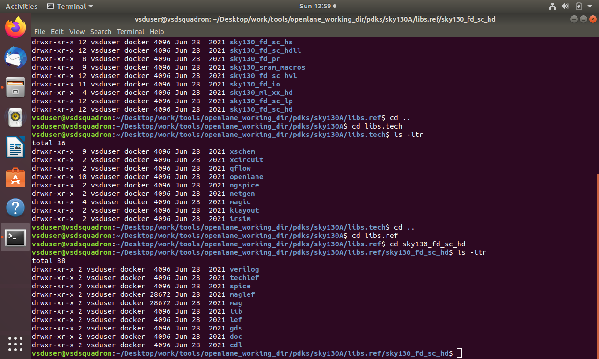
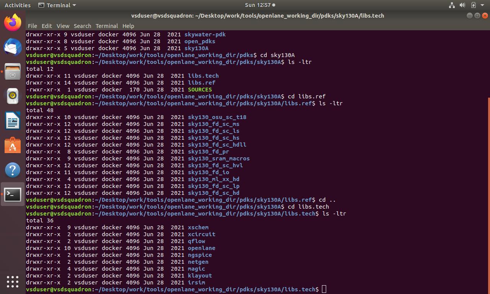
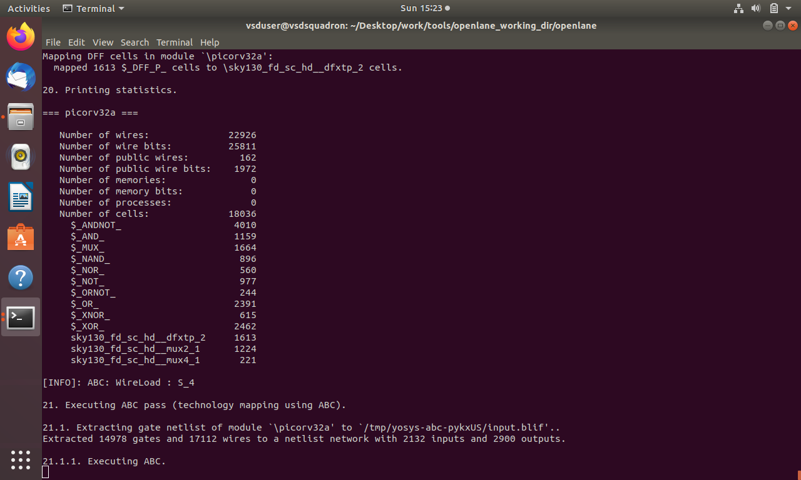
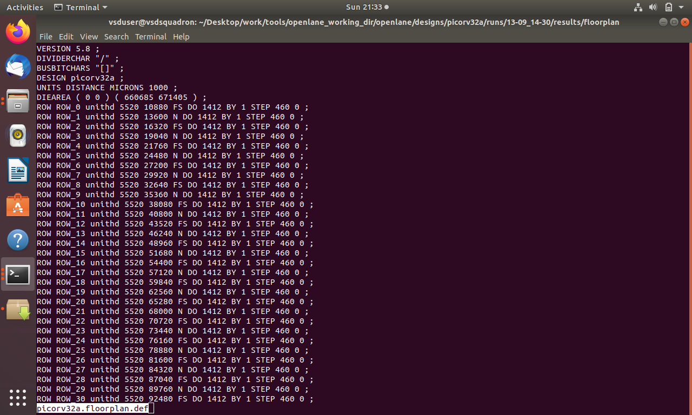
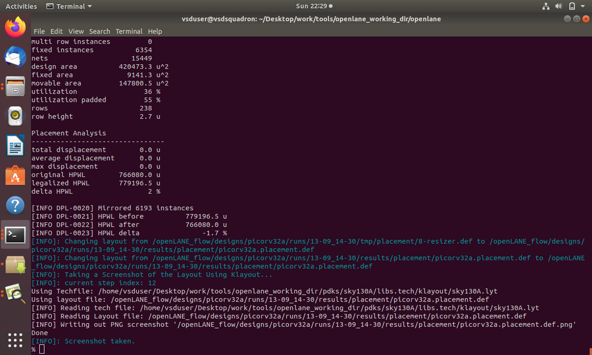

# Module 1 – Inception of open-source EDA, OpenLANE and Sky130 PDK

## Overview

This module introduces the fundamentals of ASIC Physical Design, the ASIC design flow, PDKs, standard-cell libraries, SKY130, floorplanning, placement, and the RTL-to-GDSII flow.

The module also provides practical exposure to the SKY130 PDK, library files, configuration files, synthesis, floorplanning, and placement analysis.

---

## Topics Covered

### 1. ASIC and SoC Fundamentals

- ASIC – Application Specific Integrated Circuit
- SoC – System on Chip
- Die, Core, Pads and Package
- Standard Cells
- Macros and IPs
- RTL-to-GDSII design flow

---

### 2. RISC-V and PicoRV32

- Introduction to the RISC-V architecture
- PicoRV32 processor core
- Understanding the role of a processor core in an SoC
- Using PicoRV32 as a design example for the ASIC flow

---

### 3. ASIC Design Flow

The basic ASIC implementation flow consists of:

**RTL Design → Logic Synthesis → Floorplanning → Placement → Clock Tree Synthesis → Routing → Physical Verification → Signoff → GDSII**

---

### 4. PDK and SKY130

A Process Design Kit (PDK) provides the technology-related information required by EDA tools for designing and implementing an ASIC.

The SKY130 PDK contains:

- Standard-cell libraries
- Technology files
- Timing information
- Physical design information
- Design rules
- Library characterization data

---

### 5. Standard Cell Libraries

Standard-cell libraries provide pre-designed logic cells used during synthesis and physical implementation.

Examples include:

- AND gates
- OR gates
- NAND gates
- NOR gates
- Inverters
- Multiplexers
- Flip-flops

Library files contain information such as:

- Cell names
- Cell functionality
- Timing characteristics
- Power information
- Area
- Input/output pins

---

### 6. Floorplanning

Floorplanning determines the overall physical organization of the design.

It includes:

- Core dimensions
- Die dimensions
- Placement of macros
- I/O placement
- Power distribution considerations

The objective is to create a suitable physical area for subsequent placement and routing.

---

### 7. Placement

Placement determines the physical locations of standard cells within the core area.

Important considerations include:

- Cell distribution
- Wirelength
- Congestion
- Timing
- Utilization

---

### 8. Clock Tree Synthesis

Clock Tree Synthesis (CTS) distributes the clock signal from the clock source to all sequential elements.

The main objectives are:

- Low clock skew
- Controlled clock latency
- Proper clock connectivity
- Reliable timing

---

### 9. Routing

Routing creates physical connections between the placed cells.

The routing process includes:

- Global routing
- Detailed routing
- Signal connections
- Power connections

Routing must satisfy design rules and timing requirements.

---

### 10. OpenLane and OpenROAD

OpenLane provides an automated RTL-to-GDSII implementation flow.

OpenROAD is used for several physical-design stages such as:

- Floorplanning
- Placement
- Clock Tree Synthesis
- Routing
- Timing analysis

The flow uses the RTL design together with the required PDK and library files to generate the physical implementation.

---

# Practical Work

The following screenshots document the practical work carried out during this module.

## 1. SKY130 Standard Cell Library Files

The SKY130 standard-cell library files used during the physical-design flow are shown below.

---

## 2. Library and Technology Files

The required library reference and technology files used for the design flow are shown below.

---

## 3. Configuration File

The configuration file used for setting up the design flow is shown below.

---

## 4. PicoRV32 Synthesis

The synthesis process for the PicoRV32 design is shown below.

---

## 5. Floorplanning Dimensions

The floorplanning stage and the corresponding design dimensions are shown below.

---

## 6. Placement Analysis

The placement stage and placement analysis are shown below.

---

# Key Learning Outcomes

After completing this module, I gained an understanding of:

- ASIC physical-design concepts
- ASIC and SoC architecture
- RISC-V and PicoRV32
- ASIC RTL-to-GDSII flow
- PDKs and SKY130
- Standard-cell libraries
- Library and technology files
- Floorplanning
- Placement
- Clock Tree Synthesis
- Routing
- OpenLane and OpenROAD
- Practical setup and execution of physical-design stages

---

## Conclusion

Module 1 established the foundation for understanding the ASIC Physical Design flow and the role of PDKs, standard-cell libraries, floorplanning, placement, and other implementation stages in converting an RTL design into a physical layout.
