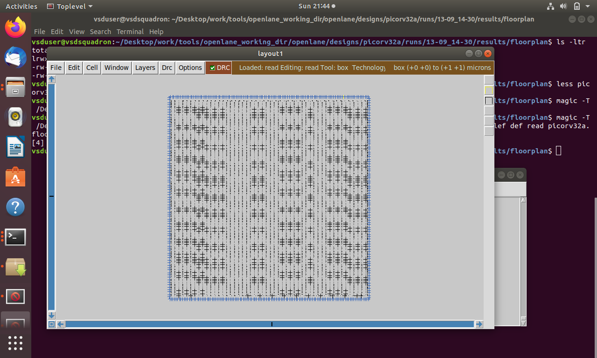
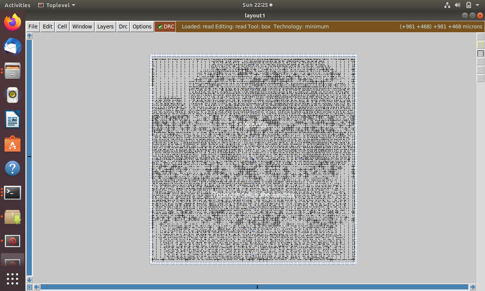
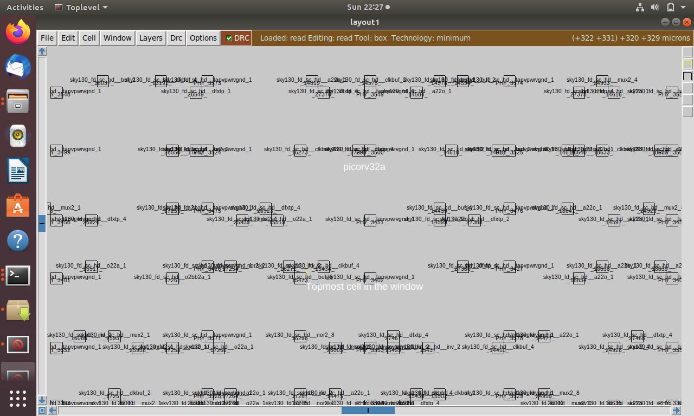
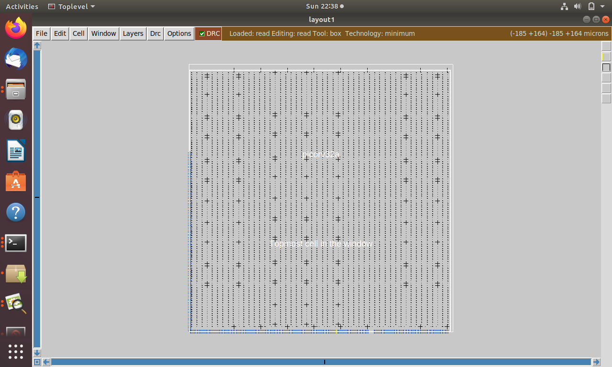

# Module 2 – Good floorplan vs bad floorplan and introduction to library cells

## Overview

Module 2 focuses on the physical implementation of an ASIC design. It covers floorplanning, placement, routing, Clock Tree Synthesis (CTS), Static Timing Analysis (STA), standard-cell design, SPICE simulation, and timing characterization.

The module also provides practical exposure to the physical design of the PicoRV32A design.

---

## 1. Physical Design Flow

The major stages of the physical design flow are:

Logic Synthesis  
↓  
Floorplanning  
↓  
Placement  
↓  
Clock Tree Synthesis (CTS)  
↓  
Routing  
↓  
Static Timing Analysis (STA)

Each stage affects the area, timing, power, and routability of the final design.

---

## 2. Floorplanning

Floorplanning is the process of deciding the physical organization of the design before placement.

Important considerations include:

- Die dimensions
- Core dimensions
- Utilization
- Aspect ratio
- Macro placement
- I/O and pin locations
- Power planning
- Routing resources

### Die and Core Dimensions

The die represents the complete physical area of the chip.

The core is the region inside the die where standard cells and other internal design components are placed.

### Utilization Factor

Utilization represents the percentage of the available core area occupied by standard cells.

A suitable utilization value is required to provide sufficient space for:

- Standard cells
- Routing
- Buffers
- Physical-design requirements

### Aspect Ratio

Aspect ratio represents the relationship between the width and height of the core.

A suitable aspect ratio helps achieve an efficient floorplan and better routing.

### Macro and I/O Placement

Macros and I/O pins must be placed carefully to:

- Reduce routing complexity
- Improve connectivity
- Reduce congestion
- Provide better power distribution

### Power Planning

Power planning provides the required power and ground connections to the cells in the design.

A proper power network helps reduce voltage drop and ensures reliable operation.

---

## 3. Placement

Placement determines the physical locations of standard cells inside the core.

### Objective of Placement

The main objectives of placement are:

- Minimize wirelength
- Reduce congestion
- Improve timing
- Optimize area
- Maintain routability
- Reduce interconnect-related delay

### Congestion and Hotspots

Congestion occurs when too many connections compete for limited routing resources in a particular region.

Highly congested regions are referred to as hotspots.

Poor placement can increase routing congestion and make the design difficult to route.

### Placement and Routing Relationship

Placement and routing are closely related.

A good placement helps reduce:

- Wirelength
- Congestion
- Delay
- Routing violations

### Placement Optimization

Placement optimization considers:

- Cell locations
- Wirelength
- Timing
- Congestion
- Capacitance
- Routing requirements

### Wirelength Estimation

The distance between connected cells contributes to the estimated interconnect wirelength.

Longer wires generally result in larger resistance and capacitance and can therefore increase delay.

### Capacitance Estimation

Interconnect capacitance affects signal transition and propagation delay.

Therefore, capacitance estimation is an important part of placement optimization.

### Buffer Insertion

Long interconnects can cause increased resistance, capacitance, and delay.

Buffers may be inserted along long interconnects to improve signal transition and reduce the effect of interconnect delay.

---

## 4. Routing

Routing establishes physical connections between the placed cells using the available metal layers.

Routing connects:

- Standard cells
- Macros
- Input/output pins
- Power connections
- Clock connections

Routing must satisfy:

- Connectivity requirements
- Design rules
- Timing requirements
- Routing-resource limitations
- Congestion constraints

The quality of placement has a direct effect on routing.

---

## 5. Clock Tree Synthesis

Clock Tree Synthesis (CTS) is the process of constructing the clock distribution network.

The clock network distributes the clock signal from the clock source to sequential elements.

CTS considers:

- Clock skew
- Clock latency
- Transition time
- Buffer insertion
- Routing delay

The objective is to distribute the clock with controlled timing characteristics.

---

## 6. Static Timing Analysis

Static Timing Analysis (STA) is used to verify whether the implemented design satisfies its timing requirements.

STA analyzes timing paths through the design, including paths between:

- Input and output ports
- Flip-flops
- Combinational logic
- Clock-related elements

Timing analysis considers parameters such as:

- Propagation delay
- Setup time
- Hold time
- Input transition
- Output load
- Cell delay
- Interconnect delay

---

## 7. Standard Cell Design

Standard cells are pre-designed and characterized building blocks used in digital IC design.

Examples include:

- Inverters
- NAND gates
- NOR gates
- Buffers
- Flip-flops
- Other logic cells

A standard cell contains:

- Transistor-level implementation
- Physical layout
- Electrical characteristics
- Timing characteristics
- Library information

The characterized information is stored in the standard-cell library and is used by synthesis and timing-analysis tools.

---

## 8. Standard Cell Characterization

Standard-cell characterization determines the electrical and timing behavior of a cell under different operating conditions.

The characterization process considers:

- Input transition
- Output load capacitance
- Supply voltage
- Propagation delay
- Transition time
- Rise time
- Fall time

The obtained information is represented in the cell library for use by EDA tools.

---

## 9. Cell Design Flow

The general cell design and characterization flow is:

Transistor-Level Implementation  
↓  
SPICE Simulation  
↓  
Characterization  
↓  
Library / Liberty Information

The transistor-level circuit is simulated using SPICE to obtain the required electrical and timing characteristics.

---

## 10. SPICE Simulation and Characterization

SPICE simulation is used to analyze the electrical behavior of a transistor-level cell.

The general simulation flow includes:

1. Read the model file.
2. Read the extracted SPICE netlist.
3. Define or recognize the required cell behavior.
4. Read the required subcircuits.
5. Attach the necessary power supply.
6. Apply the input signals.
7. Provide the output capacitance.
8. Run the simulation.
9. Analyze the output waveforms.
10. Extract the timing characteristics.

The simulation results are used to determine parameters such as propagation delay and transition time.

---

## 11. SPICE Netlist

An extracted SPICE netlist represents the transistor-level connectivity of the cell.

It can contain:

- MOS transistors
- Node connections
- Device dimensions
- Source/drain areas
- Source/drain perimeters
- Parasitic capacitances
- Subcircuit definitions

For simulation, the extracted netlist is used together with suitable transistor models, power supplies, input signals, and output loading.

---

## 12. Cell Inputs and Outputs

Important information used during cell characterization includes:

### Inputs

- Circuit/netlist
- Supply voltage
- Metal layers
- Pin locations
- Transistor information
- Input waveform

### Outputs

- Output waveform
- Output capacitance
- Propagation delay
- Transition time
- Timing characteristics

The output load capacitance has a direct effect on the delay and transition of the cell.

---

## 13. Design Specifications

The standard-cell design process includes:

- Circuit design
- Layout design
- Layout-versus-schematic verification
- Characterization

The transistor-level circuit and physical layout must correspond correctly before characterization.

---

## 14. Timing Characterization Thresholds

Specific voltage thresholds are used to measure input and output transitions.

The following timing thresholds were covered:

- `slew-low-rise-thr`
- `slew-high-rise-thr`
- `slew-low-fall-thr`
- `slew-high-fall-thr`
- `in-rise-thr`
- `in-fall-thr`
- `out-rise-thr`
- `out-fall-thr`

These threshold values are used to determine transition times and propagation delays from simulated waveforms.

---
## 15. Propagation Delay

Propagation delay is the time difference between the input threshold crossing and the corresponding output threshold crossing.

Propagation Delay = Output Threshold Crossing Time − Input Threshold Crossing Time

Propagation delay can be measured separately for:

- Rising transitions
- Falling transitions

The delay depends on factors such as:

- Input transition
- Output capacitance
- Supply voltage
- Cell design
- Interconnect characteristics

---

## 16. Transition Time

Transition time represents the time taken by a signal to move between two specified voltage thresholds.

For a falling transition:

Transition Time = time(slew-high-fall-thr) − time(slew-low-fall-thr)

For a rising transition, the corresponding rising thresholds are used.

Transition time is also associated with signal slew.

---

## 17. Electrical Characteristics

### IR Drop

IR drop is the voltage drop caused by current flowing through the resistance of the power distribution network.

Excessive IR drop can reduce the effective supply voltage available to cells.

### Crosstalk

Crosstalk is unwanted coupling between nearby interconnects.

It can affect:

- Signal integrity
- Timing
- Noise margins

### Slew

Slew represents how quickly a signal transitions between voltage levels.

Poor slew can increase delay and affect downstream cells.

### Propagation Delay

Propagation delay represents the time taken for a signal change to propagate from the input of a cell to its output.

These electrical characteristics are important during physical implementation and timing analysis.

---

## 18. Practical Physical Design Work

### PicoRV32A Floorplanning

This shows the floorplanning stage of the PicoRV32A design.

### PicoRV32A Placement

This shows the placement stage of the PicoRV32A design, where standard cells are physically positioned within the core.

### Floorplan Close View

This provides a closer view of the floorplanned design.

### Layout

This shows the physical layout of the implemented design.

---

## 19. Key Learning Outcomes

After completing Module 2, the following concepts were covered:

- ASIC physical design flow
- Floorplanning
- Die and core dimensions
- Utilization factor
- Aspect ratio
- Macro and I/O placement
- Power planning
- Standard-cell placement
- Placement optimization
- Congestion and hotspots
- Wirelength estimation
- Capacitance estimation
- Buffer insertion
- Routing
- Clock Tree Synthesis
- Static Timing Analysis
- Standard-cell design
- Standard-cell characterization
- Transistor-level implementation
- SPICE simulation
- Extracted SPICE netlists
- Cell inputs and outputs
- Timing characterization thresholds
- Propagation delay
- Transition time
- Slew
- IR drop
- Crosstalk

---

## Conclusion

Module 2 provided an understanding of the physical design process from floorplanning and placement to routing and timing analysis.

It also introduced standard-cell design and SPICE-based characterization, including the extraction of propagation delay, transition time, and other electrical and timing characteristics required for physical design and timing analysis.

The practical work on the PicoRV32A design provided hands-on exposure to floorplanning, placement, and layout.
