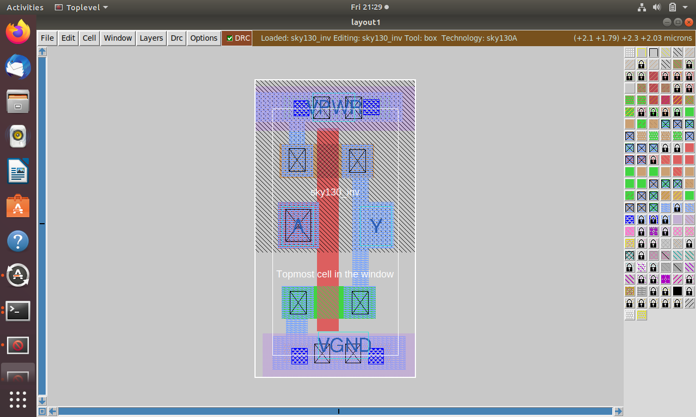
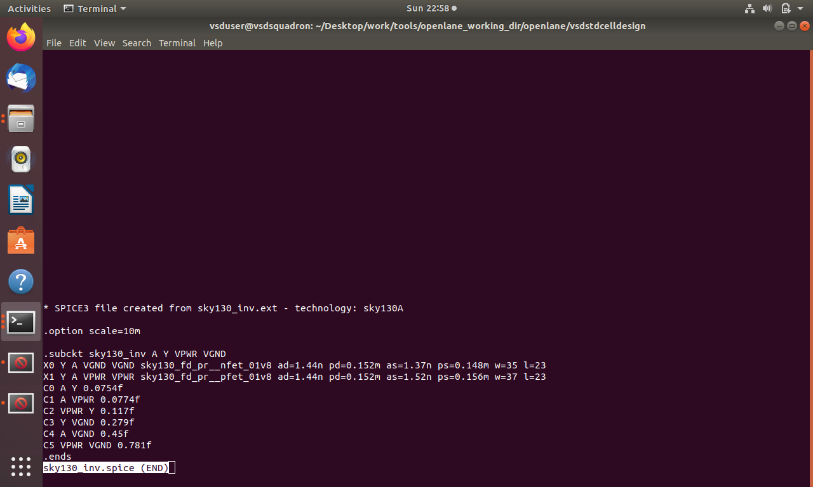
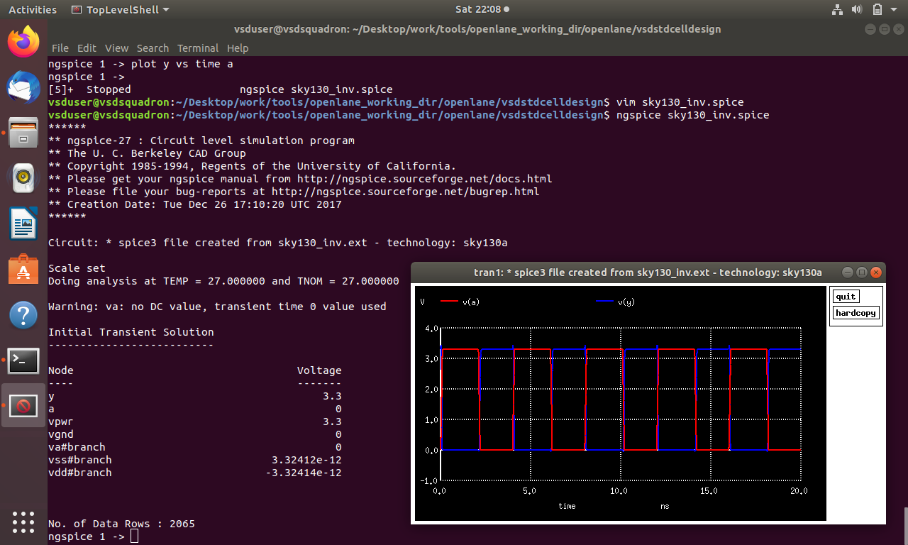
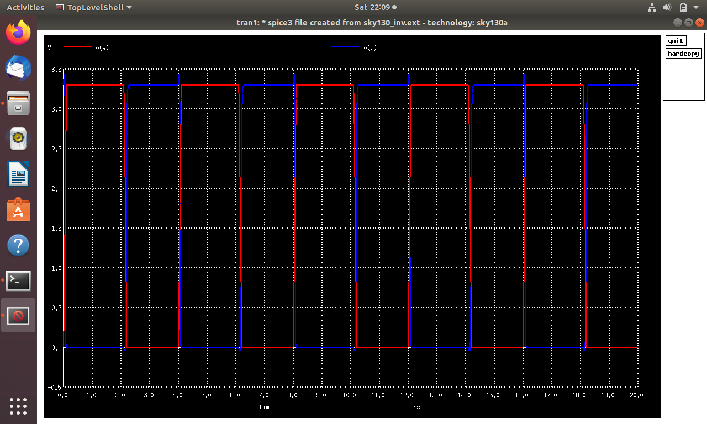

# Module 3 - Design library cell using Magic Layout and ngspice characterization

## Overview

Module 3 focuses on SPICE-based circuit simulation, CMOS device and fabrication concepts, and practical exposure to the SKY130 process and Magic layout environment.

The module covers the creation of SPICE decks and netlists, transistor-level simulation, voltage transfer characteristics (VTC), CMOS fabrication steps, well formation, implantation, oxidation, photolithography, metallization, and the basic use of the Magic layout tool with the SKY130 PDK.

---

## 1. VTC – SPICE Simulation

Voltage Transfer Characteristic (VTC) analysis is used to study the relationship between the input and output voltages of a CMOS circuit.

For a CMOS inverter:

- When the input is LOW, the PMOS is ON and the NMOS is OFF, producing a HIGH output.
- When the input is HIGH, the NMOS is ON and the PMOS is OFF, producing a LOW output.
- The transition region of the VTC represents the switching behavior of the inverter.

### SPICE Deck

A SPICE deck describes the circuit and simulation conditions required for analysis.

The SPICE deck contains:

- Circuit components
- Component connectivity
- Device parameters
- Supply voltages
- Input signals
- Output load
- Simulation commands

---

## 2. SPICE Netlist

A SPICE netlist represents the electrical connectivity of the circuit.

Each component is connected between specific nodes. A node represents a common electrical connection between two or more circuit elements.

### Important Elements

- NMOS and PMOS transistors
- Power supply
- Ground
- Input node
- Output node
- Load capacitance

### MOSFET Connectivity

A MOSFET has four terminals:

- Drain
- Gate
- Source
- Body/Substrate

The SPICE netlist specifies the connectivity and electrical parameters of these terminals.

---

## 3. MOSFET Parameters

Important transistor parameters used during SPICE simulation include:

- NMOS / PMOS device model
- Channel width (W)
- Channel length (L)
- Output load
- Supply voltage
- Source, drain, gate and substrate connections

The channel dimensions influence transistor current, switching behavior and circuit performance.

---

## 4. Identifying and Naming Nodes

Nodes must be correctly identified in a SPICE netlist.

A node represents an electrical connection between circuit elements. Naming nodes clearly makes the netlist easier to understand and helps in observing circuit voltages during simulation.

Typical nodes include:

- Input node
- Output node
- VDD / VPWR
- GND / VGND

---

# 5. CMOS Fabrication

CMOS fabrication involves a sequence of semiconductor processing steps used to create NMOS and PMOS devices and interconnect them to form integrated circuits.

The notes cover the concept of a 16-mask CMOS process.

Major fabrication operations include:

1. Substrate preparation
2. Well formation
3. Oxidation
4. Photolithography
5. Ion implantation
6. Diffusion / annealing
7. Gate formation
8. Source and drain formation
9. Contact formation
10. Metallization
11. Inter-layer dielectric formation
12. Passivation

---

## 6. N-Well and P-Well Formation

CMOS technology requires regions for fabricating NMOS and PMOS transistors.

### P-Well

A P-well is formed in an N-type region using suitable masking and ion implantation.

Boron is commonly used as the dopant for P-type regions.

### N-Well

An N-well is formed using an N-type dopant.

Phosphorus is commonly used for N-type implantation.

The implanted dopants are activated and redistributed through suitable thermal processing.

---

## 7. Twin-Tub Process

The twin-tub process creates both N-well and P-well regions.

This allows NMOS and PMOS devices to be fabricated in their respective wells while providing better control over device characteristics.

The basic process involves:

- Formation of wells
- Doping using ion implantation
- Thermal treatment
- Device isolation and subsequent transistor fabrication

---

## 8. Photolithography

Photolithography is used to transfer geometric patterns onto the semiconductor wafer.

The general process involves:

1. Applying photoresist
2. Mask alignment
3. Exposure to light
4. Development
5. Etching or implantation through the patterned region
6. Removal of the remaining photoresist

Different masks are used to define different layers and regions of the CMOS process.

---

## 9. Oxidation

Silicon dioxide (SiO₂) is formed on the silicon surface during oxidation.

SiO₂ is used for several purposes, including:

- Electrical isolation
- Gate dielectric formation
- Surface protection
- Process masking

The oxide capacitance is related to the oxide thickness and dielectric properties.

---

## 10. Ion Implantation

Ion implantation introduces controlled amounts of dopant atoms into the silicon substrate.

Typical dopants include:

- Boron for P-type regions
- Phosphorus for N-type regions

After implantation, thermal processing is used to activate the dopants and repair implantation-related crystal damage.

---

## 11. Threshold Voltage Adjustment

The threshold voltage of a MOS transistor depends on several device and process parameters.

The threshold voltage can be controlled through:

- Substrate/well doping
- Oxide thickness
- Gate material
- Body bias
- Channel engineering

The threshold voltage determines the approximate gate voltage required to establish a conducting channel.

---

## 12. Gate Formation

The gate is formed above the channel region and is separated from the semiconductor by a thin dielectric layer.

The gate controls the formation of the conducting channel between source and drain.

The gate structure is a critical part of MOS transistor operation.

---

## 13. Source and Drain Formation

Source and drain regions are formed by controlled doping of the semiconductor.

The process includes:

- Defining the required regions using photolithography
- Ion implantation
- Thermal activation
- Formation of source and drain junctions

### Lightly Doped Drain (LDD)

LDD structures are used to reduce high electric fields near the drain and improve device reliability.

They are particularly important for controlling hot-carrier effects in scaled MOS devices.

---

## 14. Hot-Electron Effect

At high electric fields near the drain, carriers can gain significant energy.

These high-energy carriers can cause reliability problems and affect device performance.

LDD structures help reduce the electric field near the drain and therefore help control hot-carrier effects.

---

## 15. Contact Formation

After transistor formation, contacts are created to provide electrical connections between device regions and higher-level interconnects.

The process includes:

- Photolithography
- Contact-hole formation
- Etching
- Contact material deposition
- Filling of contact regions

HF-based etching may be used during oxide-related processing.

---

## 16. Titanium and Tungsten Processing

Titanium and tungsten are used in contact/interconnect-related fabrication steps.

Titanium can be deposited as part of the contact formation process.

Tungsten can then be used to fill contact structures and provide electrical connections.

The notes also cover the use of chemical-mechanical polishing (CMP) to obtain a planar surface.

---

## 17. Metallization and Interconnect

After contact formation, metal layers are created to connect different devices and circuit regions.

The general sequence includes:

- Metal deposition
- Photolithography
- Patterning
- Etching
- Inter-layer dielectric formation
- Additional metal layers

Multiple metal layers allow complex circuits to be interconnected.

---

## 18. Inter-Layer Dielectric and Passivation

An inter-layer dielectric separates conductive layers and provides electrical isolation.

A final dielectric/passivation layer protects the completed chip from the surrounding environment.

The final mask can be used to open required contact or bonding regions through the protective layer.

---

## 19. Device and Process Concepts

The module also covers important device-level concepts such as:

- Doping concentration
- Oxide capacitance
- Threshold voltage
- Gate formation
- Source/drain engineering
- Short-channel effects
- Hot-electron effects
- Device isolation
- Interconnect formation

These concepts connect semiconductor fabrication processes with the electrical behavior of CMOS devices.

---

# 20. Magic Layout Tool and SKY130

The module provides practical exposure to the Magic layout environment and the SKY130 process design kit.

### Magic

Magic is an open-source VLSI layout tool used for creating and inspecting integrated-circuit layouts.

It can be used for:

- Layout creation
- Design-rule checking
- Layer inspection
- Connectivity inspection
- Technology-specific layout work

### SKY130

SKY130 is an open-source 130 nm process design kit associated with the SkyWater technology process.

The PDK provides technology information required by EDA tools for designing and verifying circuits.

---

## 21. Practical Work

The following practical work was completed during Module 3.

### CMOS Inverter

### Inverter SPICE Setup

### NGSPICE Setup

### NGSPICE Simulation Graph

---

# 22. Key Learning Outcomes

After completing Module 3, the following concepts were studied and practiced:

- Creation of SPICE decks
- Understanding SPICE netlist connectivity
- Identification and naming of circuit nodes
- CMOS inverter simulation
- VTC analysis
- MOSFET device parameters
- CMOS fabrication flow
- 16-mask CMOS process concepts
- N-well and P-well formation
- Twin-tub process
- Photolithography
- Oxidation
- Ion implantation
- Diffusion and thermal processing
- Threshold-voltage control
- Gate formation
- Source and drain formation
- LDD and hot-electron effects
- Contact formation
- Titanium and tungsten processing
- Chemical-mechanical polishing
- Metallization and interconnect
- Inter-layer dielectric and passivation
- SKY130 PDK concepts
- Basic Magic layout environment
- NGSPICE-based circuit simulation

---

# 23. Conclusion

Module 3 provided an understanding of the connection between transistor-level circuit simulation, semiconductor fabrication, and physical layout.

The SPICE and NGSPICE exercises provided practical exposure to transistor-level circuit representation and simulation, while the CMOS fabrication topics explained how the physical structures of NMOS and PMOS devices are created on a silicon substrate.

The introduction to Magic and the SKY130 PDK further connected these device and fabrication concepts with the practical VLSI physical-design environment.
