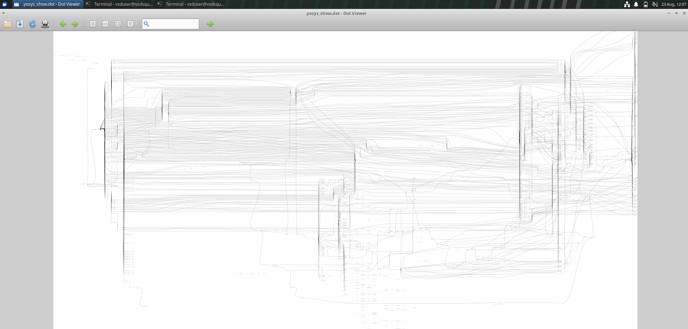
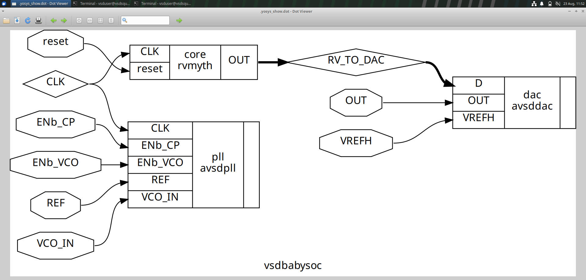
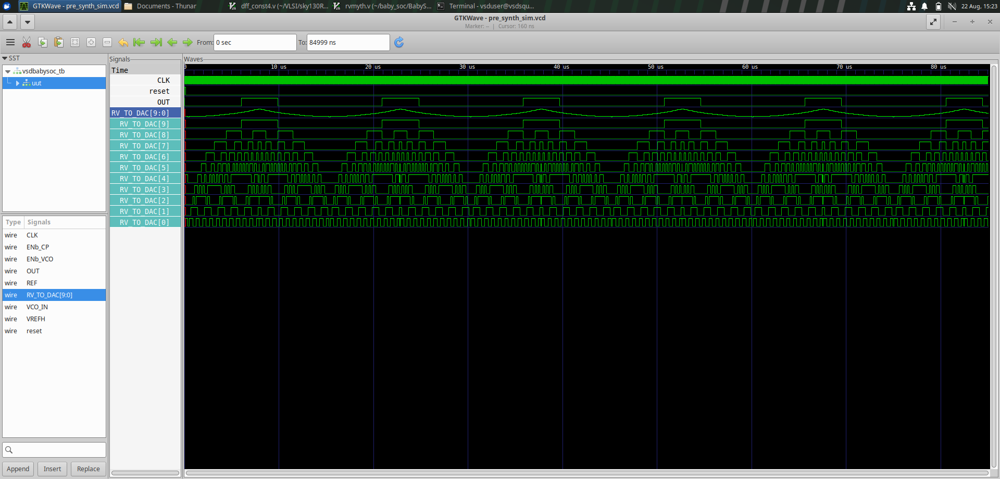
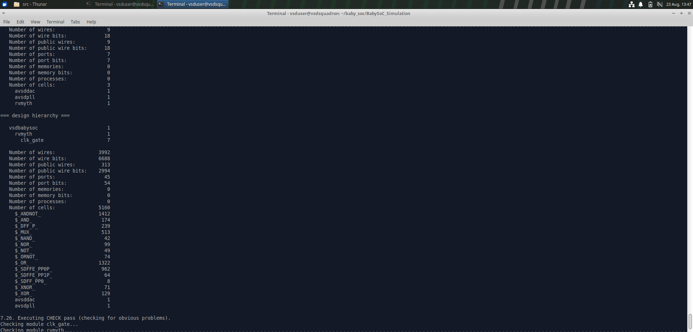
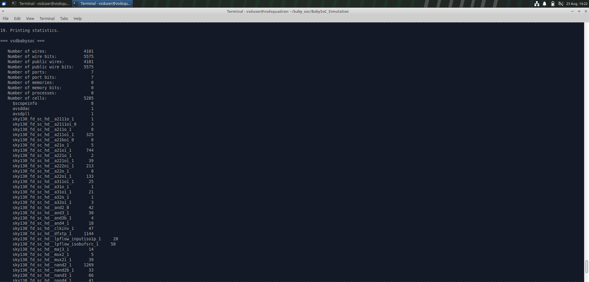
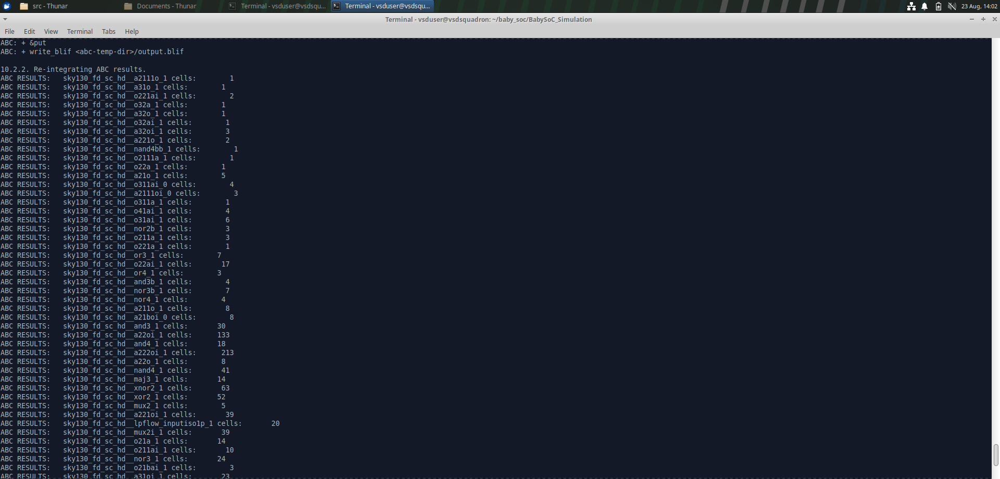
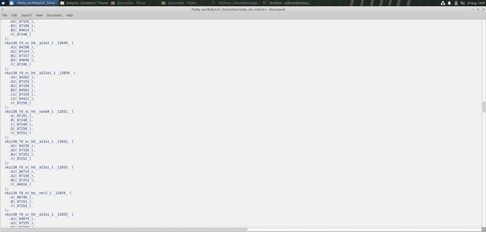
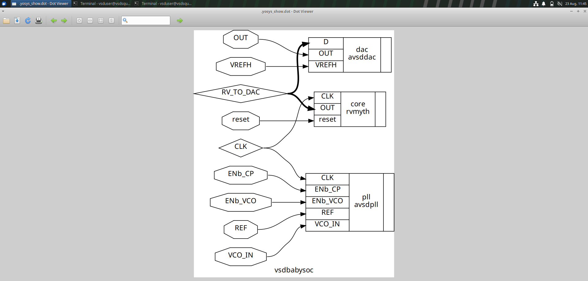
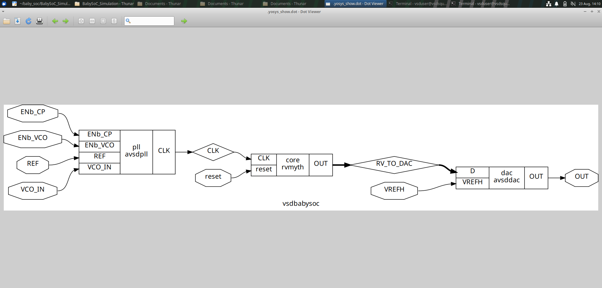
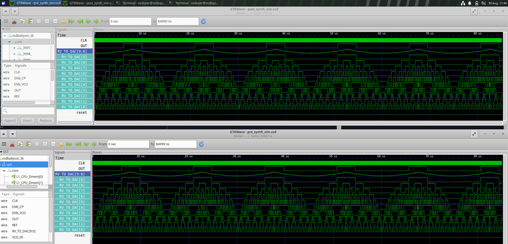

# VLSI RTL Design and Synthesis

This repository contains my hands-on work completed during the VLSI RTL Design and Synthesis training. The work covers RTL design, functional simulation, synthesis, logic optimization, technology mapping, synthesized netlist analysis, and Gate-Level Simulation (GLS) using Verilog, Icarus Verilog, Yosys, ABC, GTKWave, and the Sky130 standard-cell library.

The repository contains work from Modules 1–5, with a detailed summary of the VSDBabySoC work performed during the training.

---

# Module 1 – Introduction to Verilog RTL Design and Synthesis

Module 1 introduced the fundamentals of RTL design, simulation, and synthesis using Verilog.

## Work Completed

- Introduction to RTL design using Verilog
- Writing and understanding Verilog RTL modules
- Combinational and sequential logic
- Testbench development
- Functional simulation using Icarus Verilog
- VCD waveform generation
- Waveform analysis using GTKWave
- Introduction to Yosys
- Reading RTL using Yosys
- RTL synthesis
- Netlist generation
- Understanding RTL-to-netlist conversion
- Analysis of synthesized logic

---

# Module 2 – Timing, Libraries and Flip-Flop Coding Styles

Module 2 focused on timing concepts, standard-cell libraries, synthesis methods, and efficient sequential coding styles.

## Work Completed

- Understanding timing concepts
- Introduction to standard-cell libraries
- Understanding Liberty (`.lib`) files
- Reading Liberty files using Yosys
- Understanding standard-cell information
- Hierarchical synthesis
- Flat synthesis
- Comparison of hierarchical and flat synthesis
- Analysis of synthesized netlists
- Efficient flip-flop coding styles
- Comparison of different flip-flop implementations
- Understanding how RTL coding style affects synthesis

---

# Module 3 – Logic Optimization

Module 3 focused on combinational and sequential logic optimization.

## Work Completed

- Combinational logic optimization
- Sequential logic optimization
- Constant propagation
- Boolean logic optimization
- Optimization of redundant logic
- State optimization
- Retiming
- Sequential logic cloning
- Analysis of optimized RTL
- Comparison of different RTL coding styles
- Good and bad RTL coding styles
- Synthesis and netlist comparison
- Analysis of optimized synthesized logic

Different RTL examples were synthesized and compared to understand how RTL coding style affects the resulting hardware.

---

# Module 4 – Gate-Level Simulation and Verification

Module 4 focused on Gate-Level Simulation and verification of synthesized designs.

## Work Completed

- Understanding Gate-Level Simulation (GLS)
- Post-synthesis simulation
- Simulation using synthesized netlists
- Use of standard-cell functional models
- Understanding cell-level delays
- RTL waveform analysis
- GLS waveform analysis
- RTL versus GLS waveform comparison
- Understanding timing differences
- Functional verification using GTKWave

The module demonstrated how the synthesized gate-level implementation can be verified against the original RTL design.

---

# Module 5 – Advanced RTL and Synthesis Experiments

Module 5 involved additional practical experiments related to RTL design, synthesis, optimization, and verification.

## Work Completed

- Advanced RTL design experiments
- Functional simulation
- Synthesis using Yosys
- Netlist generation
- Logic optimization
- Technology mapping
- Synthesized design analysis
- Waveform analysis
- Comparison of different RTL implementations
- Verification of synthesized hardware

---

# VSDBabySoC – Detailed RTL to GLS Flow

VSDBabySoC was one of the major practical exercises performed during the training.

The objective was to understand the complete flow from RTL simulation through synthesis, optimization, technology mapping, synthesized netlist generation, and Gate-Level Simulation.

---

## 1. VSDBabySoC Design

The VSDBabySoC design was studied at the RTL level along with its major components and supporting modules.

The design included:

- RVMYTH processor
- VSDBabySoC top-level module
- Clock-related logic
- DAC interface
- PLL model
- Sky130 standard-cell models

The design hierarchy and connections between the major blocks were examined before synthesis.

### RVMYTH



### RVMYTH and VSDBabySoC



---

## 2. Pre-Synthesis RTL Simulation

The VSDBabySoC RTL was compiled and simulated using Icarus Verilog.

The simulation generated a VCD waveform file, which was opened using GTKWave.

The waveform was analyzed to verify the functional behavior of the RTL before synthesis.

### Pre-Synthesis GTKWave



---

## 3. Yosys Synthesis

The VSDBabySoC RTL was synthesized using Yosys.

The Sky130 standard-cell Liberty library was read before technology mapping.

The synthesis process included:

- Reading the Verilog RTL
- Elaborating the design
- RTL optimization
- Logic synthesis
- Technology mapping
- Standard-cell mapping
- Synthesized netlist generation

### Synthesis Result



---

## 4. Synthesis Statistics

After synthesis, Yosys statistics were examined to understand the hardware generated from the RTL.

The statistics provided information about the cells present in the synthesized design.

### Yosys Synthesis Statistics



---

## 5. ABC Optimization and Technology Mapping

ABC was used as part of the synthesis flow for logic optimization and technology mapping.

The generated cells and mapped netlist were examined after synthesis.

### ABC Cell Information



### ABC Netlist



---

## 6. Synthesized Schematic

The synthesized design was visualized using Yosys schematic generation.

The schematic provided a graphical representation of the synthesized hardware and helped in understanding the structure of the mapped design.

### BabySoC Schematic



### VSDBabySoC Schematic



---

## 7. Synthesized Netlist

After synthesis and technology mapping, the synthesized netlist was generated.

The synthesized netlist contains Sky130 standard-cell instances corresponding to the logic generated from the original RTL.

The netlist was subsequently used for Gate-Level Simulation.

---

## 8. Gate-Level Simulation

The synthesized netlist was simulated using the Sky130 Verilog functional models.

The correct Sky130 standard-cell Verilog model was included during compilation.

The `UNIT_DELAY` macro was also defined for the functional cell models.

-DUNIT_DELAY=#1

During the process, a compilation issue occurred because the required Sky130 Verilog model was initially referenced from an incorrect path.

After correcting the Sky130 Verilog model path and defining `UNIT_DELAY`, the Gate-Level Simulation was successfully executed.

---

## 9. RTL vs GLS Waveform Comparison

The pre-synthesis RTL waveform and post-synthesis GLS waveform were compared using GTKWave.

The comparison was used to verify whether the synthesized implementation preserved the functional behavior of the RTL.

### Pre-Synthesis vs Post-Synthesis Waveform



The important functional behavior was preserved after synthesis.

The RTL and GLS waveforms showed the same logical behavior for the tested signals. Any small timing differences observed in GLS are due to the synthesized implementation and standard-cell delays.

---

## 10. Complete VSDBabySoC Flow

```text
RTL Design
     |
     v
RTL Simulation
     |
     v
VCD Waveform
     |
     v
Yosys Synthesis
     |
     v
RTL Optimization
     |
     v
ABC Logic Optimization
     |
     v
Sky130 Technology Mapping
     |
     v
Synthesized Netlist
     |
     v
Gate-Level Simulation
     |
     v
GTKWave
     |
     v
RTL vs GLS Verification
```

# RTL vs GLS Comparison

The RTL and GLS simulations were compared using their GTKWave waveforms.

## RTL Simulation

The RTL simulation represents the behavior of the design before synthesis and is primarily used to verify the logical functionality of the Verilog RTL.

## Gate-Level Simulation

The GLS simulation uses the synthesized netlist and Sky130 standard-cell functional models. It therefore represents the behavior of the technology-mapped gate-level implementation.

## Comparison

The important functional signals showed the same logical behavior in both simulations.

The RTL and GLS waveforms matched functionally for the tested design. The main difference observed between RTL and GLS was timing, since the gate-level implementation includes standard-cell delays.

```text
RTL:
Functional behavior before synthesis

GLS:
Functional behavior after synthesis with standard-cell implementation effects

The matching waveform confirms that the synthesized implementation preserved the required functional behavior for the tested design.

---

# VSDBabySoC Screenshots

The following screenshots document the major stages of the VSDBabySoC flow:

1. `rvmyth.png` – RVMYTH RTL/design view
2. `rvmyth_babysoc.png` – RVMYTH and VSDBabySoC view
3. `rvtodac.png` – Pre-synthesis RTL simulation in GTKWave
4. `synth_babysoc.png` – VSDBabySoC synthesis
5. `stats_babysoc.png` – Yosys synthesis statistics
6. `abc_cells.png` – ABC cell information
7. `abc_netlist.png` – ABC netlist
8. `babysoc_show.png` – BabySoC synthesized schematic
9. `vsdbabysoc_show.png` – VSDBabySoC synthesized schematic
10. `pre_post_wave.png` – Pre-synthesis and post-synthesis matching waveform comparison

---

# Tools and Technologies Used

- Verilog
- Icarus Verilog
- GTKWave
- Yosys
- ABC
- Sky130 PDK
- Sky130 standard-cell Verilog models
- Liberty (`.lib`) files
- GVim
- Ubuntu/Linux
- Git
- GitHub

---

# Key Learning Outcomes

Through these experiments, I gained practical experience in:

- RTL design using Verilog
- Testbench development
- Functional simulation
- VCD generation
- GTKWave waveform analysis
- RTL synthesis using Yosys
- Understanding standard-cell libraries
- Reading Liberty files
- Hierarchical synthesis
- Flat synthesis
- Combinational logic optimization
- Sequential logic optimization
- Constant propagation
- State optimization
- Retiming
- Sequential logic cloning
- ABC technology mapping
- Sky130 standard-cell mapping
- Synthesized netlist analysis
- Gate-Level Simulation
- RTL versus GLS waveform comparison
- Debugging synthesis and simulation issues
- Git and GitHub version control

---

# Conclusion

The VLSI RTL Design and Synthesis training provided hands-on experience with the major stages of digital IC design, from RTL development and functional simulation to synthesis, optimization, technology mapping, netlist generation, and Gate-Level Simulation.

The VSDBabySoC work provided practical experience with a larger RTL design and demonstrated the complete RTL-to-GLS flow using Yosys, ABC, Sky130 standard cells, Icarus Verilog, and GTKWave. The matching pre-synthesis RTL and post-synthesis GLS waveforms verified that the synthesized implementation preserved the required functional behavior for the tested design.

